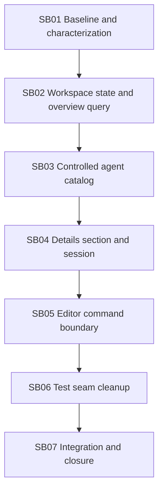

# Phase plan

| Phase | Primary files | Proof tier | Progression gate |
|---|---|---|---|
| SB01 | bundle evidence only | Standard | source/test baseline exact and green |
| SB02 | page, route/state, overview query, DI | Behavioral | URL unchanged; no EF in page |
| SB03 | page + catalog component/controller | Behavioral | catalog controlled; host actions page-owned |
| SB04 | details component + section/session/controller load | Behavioral | real dialog renders without reflection/private seeding |
| SB05 | details controller commands + component | Behavioral | all external I/O absent from dialog |
| SB06 | target tests + durable boundary tests | Behavioral | no private reflection/uninitialized services; expected discovery |
| SB07 | no feature expansion | Governed closure | focused/stable/portability/browser/architecture green |

No phase is parallel-safe. Each later phase relies on the public contracts and state owner
selected by the previous phase.
