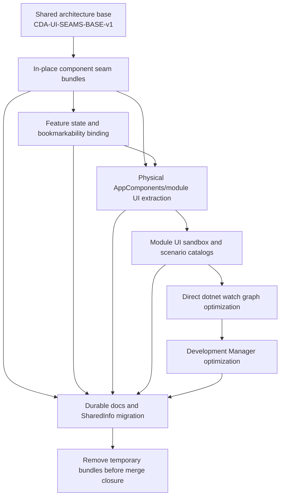

# Multi-bundle program sequence

## Dependency flow

## Stage 0 — shared base

This bundle freezes cross-program decisions only. It does not implement a feature.

## Stage 1 — logical seam extraction in place

Use many small child bundles. Each owns one coherent outcome, such as:

- remove direct persistence access from a route page;
- make one detail editor section controlled;
- replace child-owned dialog opening with a typed intent;
- extract one file workflow controller;
- remove one service locator;
- move one deterministic policy out of a partial page.

Do not bundle several large screens solely because they share a project.

## Stage 2 — bookmarkability binding

After a feature has one semantic state owner:

- introduce the feature URL state/codec/reducer;
- bind state transitions to Push/Replace navigation;
- make significant overlays route-driven;
- preserve existing visual presentation when that remains the product decision.

The supplied bookmarkability plan remains the primary source for this stage.

## Stage 3 — physical UI project extraction

Create or expand `CanDoItAll.Modules.<Feature>.UI` only after:

- component seams are proven;
- project dependencies are known;
- persistence/runtime implementations can remain outside;
- component tests and CSS can move cleanly.

Move application-wide feature-neutral pieces into `AppComponents` only when its dependency
direction remains clean.

## Stage 4 — sandbox and scenarios

Create a small browser host and deterministic module catalogs. Keep Components and
FileTools live. Exclude unrelated CanDoItAll runtime projects.

## Stage 5 — direct `dotnet watch`

Measure and optimize the direct watch graph after UI projects exist. A smaller graph is
the expected structural gain from the preceding work.

## Stage 6 — development Manager

Adapt the Manager to launch and observe the same optimized hosts and watch modes. Do not
let Manager-specific behavior dictate the lower-level architecture.

## Bundle sizing rule

A child bundle is too large when:

- it has more than one independent state owner;
- it combines logical seam extraction, routing, physical move, and redesign without a
  strict dependency reason;
- it touches several module ownership boundaries;
- its rollback cannot restore one coherent behavior;
- its acceptance criteria cannot name the responsibility that left the original
  component.

## Coordination rule

The first concrete child bundle is prepared only after the independent test repair now
running against `development` is complete and the repository baseline has been refreshed.
