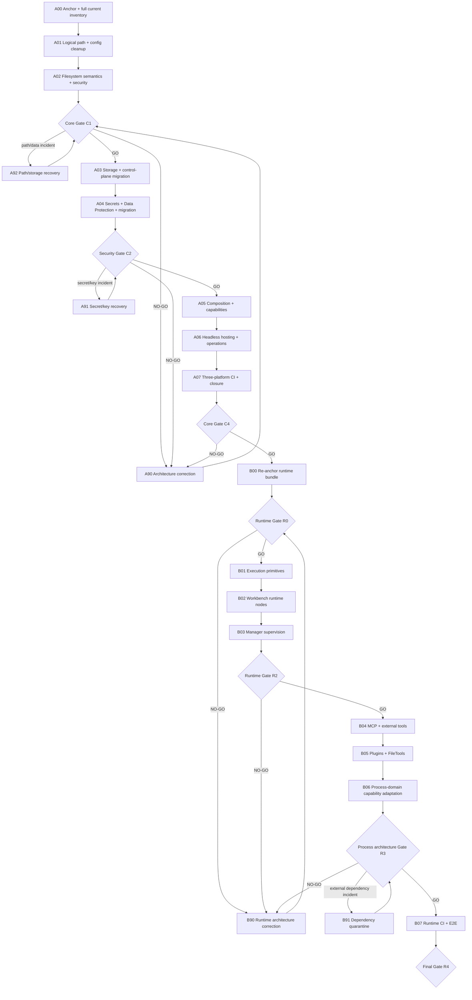

# Program sequencing

## Dependency graph

## Why filesystem precedes storage and secrets

The requested order begins with basic slash/path work. The bundle then inserts filesystem semantics before storage and secret implementation because storage and key safety depend on:

- the correct logical/physical path distinction;
- root-specific case behavior;
- symlink/reparse containment;
- atomic write and cross-process locking;
- Unix modes and ownership.

Storage migration comes before secret migration because control-plane roots, Data Protection key-ring locations, database-profile files, and vault roots must already have stable path/atomicity semantics. This is a dependency decision, not a reduction in the priority of secrets.

## Core gates

| Gate | After | Required evidence | Reviewers | Unlocks |
|---|---|---|---|---|
| `C0` | A00 | Exact anchor, baseline, complete classified inventory, persistence map | Architect + runtime validator | A01 |
| `C1a` | A01 | Canonical logical paths, portable config, compatible path owners | Architect + security | A02 |
| `C1` | A02 | Case/determinism, link containment, atomicity, locking, modes, watcher convergence | Architect + security + runtime | A03 |
| `C2a` | A03 | Transactional storage/control-plane migration and rollback | Architect + data/runtime | A04 |
| `C2` | A04 | Secure providers, key-ring protection, legacy migration, restart, redaction | Architect + security + runtime | A05 |
| `C3a` | A05 | Narrow adapters, truthful composition/readiness, architecture guards | Architect | A06 |
| `C4` | A07 | Active Windows/Ubuntu/macOS CI, publish/start/restart/migration, rollback, exact handoff commit | Architect + security + QA/runtime + operator | B00 |

## Runtime gates

| Gate | After | Required evidence | Reviewers | Unlocks |
|---|---|---|---|---|
| `R0` | B00 | Core C4 anchor, full runtime inventory, ownership map, split decision | Architect + MAF/process owners | B01 |
| `R1a` | B01 | One execution primitive/lifecycle owner, executable/env/kill/redaction actual-host proof | Runtime + security | B02 |
| `R2` | B03 | Safe Manager ownership/discovery/termination and watcher convergence | Runtime + security + operator | B04 |
| `R3a` | B04 | MCP/external tool executable, secret, output, lifecycle proof | Runtime + security | B05 |
| `R3b` | B05 | Docker/FileTools/native dependency compatibility and truthful degradation | Integration + security | B06 |
| `R3` | B06 | Processes semantic ownership, capability-based strategies, authority/evidence proof | Process + MAF + security | B07 |
| `R4` | B07 | Full actual-host runtime E2E, failure injection, Windows regression, support matrix | All review roles | Program complete |

## Runtime split triggers

`B00` must create smaller child execution bundles before implementation when any of these are true:

- more than 60 production files are expected to change;
- more than eight project ownership boundaries require coordinated changes;
- source changes are required in an external NuGet/package repository;
- Manager process discovery, Workbench runtime nodes, and MCP cannot retain independent merge/review gates;
- the MAF/process architecture has materially changed since Core C4;
- an ordinary subbundle would contain unrelated migration, UI, native, and process-domain changes.

The current package remains the umbrella even when child bundles are created.

## Mandatory execution loop

For every mandatory or invoked conditional subbundle:

1. Read the root contract, current bundle README, subbundle prompt, findings, requirements, and source manifest.
2. Verify prerequisite gate evidence and exact source anchor.
3. Record git status and preserve unrelated work.
4. Reproduce baseline/characterization.
5. Add a failing-first test or named characterization artifact.
6. Implement only the subbundle scope.
7. Run focused actual-host validation.
8. Run the stable Windows regression gate.
9. Update requirements, source references, findings, ADRs, and evidence.
10. Obtain the required independent review.
11. Record GO/NO-GO and stop on NO-GO.
