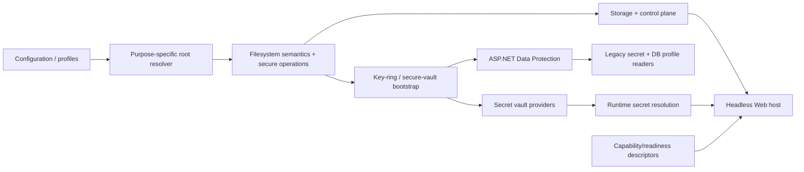

# Core target solution

## Logical view

## Component responsibilities

### Pure logical path contract

- canonical `/` serialization;
- validation and segment rules;
- field-scoped legacy reader;
- no dependency on OS native APIs;
- ordinal semantics.

### Purpose-specific physical path/root contract

- native root resolution for workspace, control plane, keys, state/logs, temp;
- foreign absolute path detection;
- host-bound record metadata/rebind;
- root/volume filesystem comparer and link/mode policy.

### Secure filesystem operations

- same-directory temporary commit;
- flush/replace/backup;
- bounded cross-process lock;
- restrictive mode application/verification;
- link-safe cleanup;
- deterministic enumeration and filename policy.

### Storage/control plane

- versioned logical locators;
- host-bound physical configuration;
- migration journal and backup;
- authoritative root selection;
- atomic profile/catalog updates.

### Security

- truthful provider probe/selection;
- Windows DPAPI, macOS Keychain, Linux Secret Service, explicit headless provider;
- independent Data Protection key-ring bootstrap;
- transactional migration among old and new formats;
- redaction, rotation, recovery.

### Composition/readiness

- narrow owner-specific registrations;
- mandatory provider fail-fast;
- optional capability degradation;
- support-profile diagnostics.

## Project placement decision

Do not pre-create a generic `CanDoItAll.Platform` project.

During A00/A01, inspect dependency direction. Place a pure logical path contract in the lowest existing neutral layer that both Infrastructure and MAF can consume without reverse references. Add a dedicated abstractions project only when the project graph proves that:

- multiple owners need the same pure contract;
- `SharedKernel` would become polluted with infrastructure behavior;
- placing it in Infrastructure would create a reverse dependency;
- the project remains small and free of native implementations.

Native/root/secret adapters stay with their owning modules.
