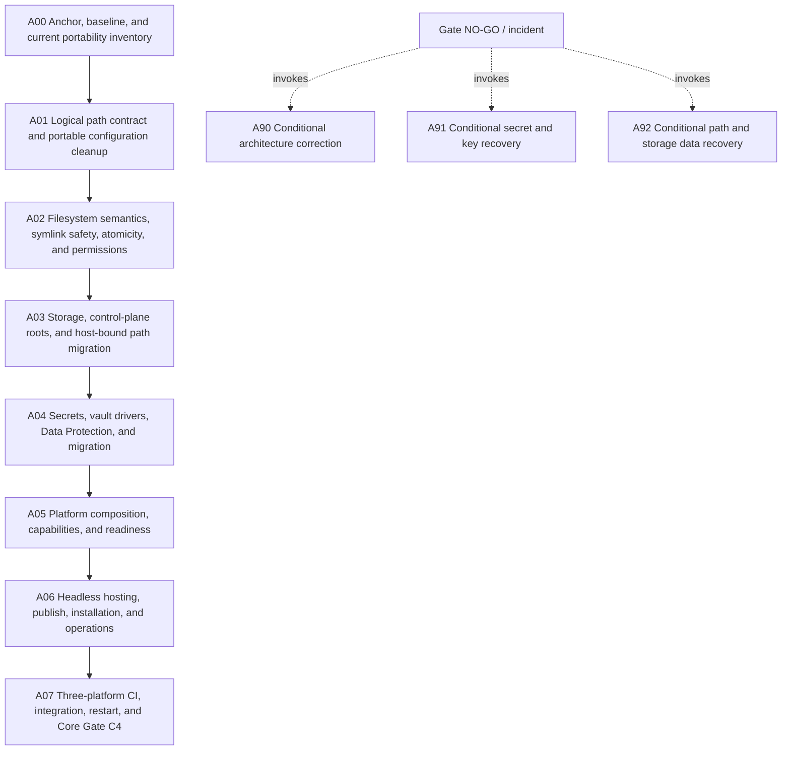

# Core portability phase plan

## Entry rule

Execute A00 first. A01 is ineligible until C0 is GO. Runtime bundle work is forbidden until C4.

## Execution order

1. `A00` — Anchor, baseline, and current portability inventory
2. `A01` — Logical path contract and portable configuration cleanup
3. `A02` — Filesystem semantics, symlink safety, atomicity, and permissions
4. `A03` — Storage, control-plane roots, and host-bound path migration
5. `A04` — Secrets, vault drivers, Data Protection, and migration
6. `A05` — Platform composition, capabilities, and readiness
7. `A06` — Headless hosting, publish, installation, and operations
8. `A07` — Three-platform CI, integration, restart, and Core Gate C4

Conditional paths:

- `A90` — Conditional architecture correction
- `A91` — Conditional secret and key recovery
- `A92` — Conditional path and storage data recovery

## Subbundle dependency map

## Critical subbundles

- **A00** — Re-anchor the supplied plan to the exact execution checkout and produce a complete, classified inventory before product code changes.
- **A01** — Fix the lowest-level slash, root, and path-category semantics before storage, secrets, or runtime changes.
- **A02** — Create a trustworthy filesystem foundation for storage and key material on Windows, Linux, and macOS.
- **A03** — Move storage and control-plane state onto the new path/filesystem contracts with transactional compatibility and rebind semantics.
- **A04** — Provide truthful secure secret persistence on Windows, Linux, and macOS while preserving existing encrypted data.
- **A05** — Wire the proven path/filesystem/storage/security implementations through narrow composition and truthful capability diagnostics.
- **A07** — Create durable Windows/Linux/macOS evidence and a versioned handoff anchor for the runtime/tools/process bundle.
- **A90** — Repair a foundational ownership, dependency, contract, or scope defect without smuggling correction into a later implementation subbundle.
- **A91** — Recover protected state safely after an interrupted, partially committed, or unreadable secret/key migration.
- **A92** — Recover control-plane/storage state after incorrect path conversion, host rebind, partial move, or catalog corruption.

## Progression rules

- A downstream subbundle is ineligible until every prerequisite gate is GO.
- A conditional subbundle freezes and invalidates dependent evidence until re-review.
- Later evidence that contradicts a completed foundation reopens it.
- Only `C4` may close this bundle.
