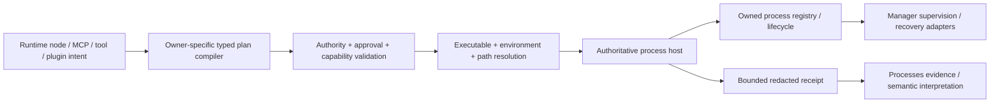

# Runtime target solution

## Execution pipeline

## Owner-specific compilers

- Workbench compiles runtime-node metadata.
- MCP compiles local stdio descriptors.
- External tools compile capability descriptors.
- Plugins compile approved recipe arguments.
- Processes selects strategies and interprets outcomes.

They share execution primitives but do not share domain semantics.

## Authoritative execution primitive

Default direction:

- preserve `LocalWorkspaceProcessHost` contracts;
- extract lower-level reusable pieces only when dependency analysis requires it;
- inject the same host/registry into workspace runtime, external tools, Docker/plugin tools, and other local execution surfaces;
- keep boundary/isolation truth explicit: policy-only execution is not an OS sandbox.

## Optional presentation/native adapters

- terminal presentation (Workbench);
- Windows elevation;
- Windows WMI recovery discovery;
- Linux proc recovery discovery;
- macOS recovery discovery;
- native process-group/Job Object adapter only when characterization requires it;
- desktop/FileTools launch.

These do not become mandatory for headless direct execution.

## Processes integration

Process strategies declare required stable capability IDs. Processes decides:

- whether a strategy is eligible;
- whether an alternate strategy exists;
- how missing capability affects the process;
- how receipts/evidence/recovery/escalation are interpreted.

Host adapters report facts and execute authorized plans; they do not decide process meaning.
