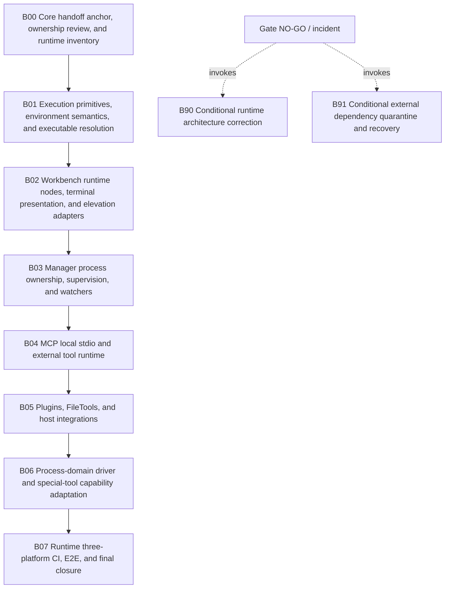

# Runtime/tools/process phase plan

## Entry rule

This bundle normally waits for Core Gate C4. The operator-authorized provisional handoff in the core bundle permits B00 to re-anchor to the recorded exact commits and issue R0 before B01 while C4/hosted/macOS support remains deferred.

## Execution order

1. `B00` — Core handoff anchor, ownership review, and runtime inventory
2. `B01` — Execution primitives, environment semantics, and executable resolution
3. `B02` — Workbench runtime nodes, terminal presentation, and elevation adapters
4. `B03` — Manager process ownership, supervision, and watchers
5. `B04` — MCP local stdio and external tool runtime
6. `B05` — Plugins, FileTools, and host integrations
7. `B06` — Process-domain driver and special-tool capability adaptation
8. `B07` — Runtime three-platform CI, E2E, and final closure

Conditional paths:

- `B90` — Conditional runtime architecture correction
- `B91` — Conditional external dependency quarantine and recovery

## Subbundle dependency map

## Critical subbundles

- **B00** — Rebase the runtime plan to the exact core-portability commit and reapprove ownership before touching process/runtime code.
- **B01** — Make one typed, OS-correct, lifecycle-owned process execution foundation before adapting Workbench, Manager, MCP, or plugins.
- **B02** — Replace the Windows/PowerShell runtime-node launcher with typed direct execution and optional platform presentation adapters.
- **B03** — Make Manager recovery and supervision safe on Windows, Linux, and macOS without name-only termination or watcher assumptions.
- **B04** — Adapt local MCP and external tools to the authoritative execution, executable, environment, secret, and lifecycle contracts.
- **B05** — Adapt Docker, desktop opening, FileTools, and other external/native integrations without making unverified dependencies part of the core support claim.
- **B06** — Connect host capabilities to process strategies and special/domain drivers while preserving Processes as the semantic owner.
- **B07** — Prove runtime nodes, Manager, MCP, tools, plugins, and Processes on actual Windows/Linux/macOS hosts and close the full Unix portability program.
- **B90** — Repair duplicated execution, lifecycle, capability, or process-semantic ownership before downstream integration continues.
- **B91** — Contain an unsafe or unsupported FileTools, Docker, Node/Playwright, terminal, or native discovery dependency without weakening unrelated core/runtime behavior.

## Progression rules

- A downstream subbundle is ineligible until every prerequisite gate is GO.
- A conditional subbundle freezes and invalidates dependent evidence until re-review.
- Later evidence that contradicts a completed foundation reopens it.
- Only `R4` may close this bundle.
