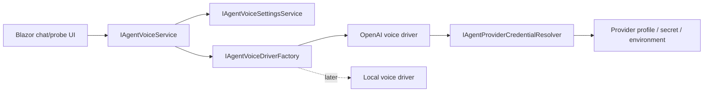
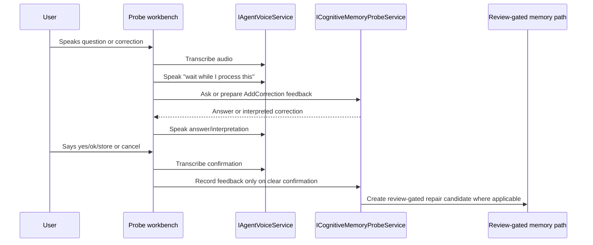

# Target Solution

## Project Boundary

- Add `C:\repositories\CanDoItAll\src\CanDoItAll.AgentFramework.Voice\CanDoItAll.AgentFramework.Voice.csproj`.
- The project owns voice driver contracts, factory, OpenAI driver implementation, request/result records, settings normalization, and the application service used by UI surfaces.
- AgentFramework Models own serializable voice metadata and settings records when they must be shared by UI, persistence, and services.

## Driver Shape

- TTS and STT are separate capabilities even when the same driver/provider handles both.
- Driver resolution is exact: disabled, missing provider, unsupported driver, or failed credential resolution produces a surfaced error.
- OpenAI provider code calls official REST endpoints and keeps request construction testable behind `HttpClient`.

## Settings

- General voice settings include:
  - STT enabled/driver/provider/model/language.
  - TTS enabled/driver/provider/model/voice/response format/sample text.
  - A visible AI-generated audio disclosure string.
- Per-agent voice settings include:
  - `CanUseVoiceMode`.
  - optional `PreferredVoiceId`.
- Effective TTS voice resolution order:
  1. per-agent `PreferredVoiceId` when voice mode is allowed and the value is configured
  2. general TTS voice
  3. no fallback; validation error if neither is configured for enabled TTS

## UI Flow

- General voice settings live in the AgentFramework module settings area.
- Agent details gain a Voice tab/section that controls per-agent voice access and override.
- `ChatWorkspacePanel` gains reusable audio-mode controls and visual state parameters.
- Normal chat and contextual floating chat own the JS recording/playback calls and call the shared voice service.

## Cognitive Memory Flow

- The "store" path is an interaction wrapper over existing probe feedback/review mechanics, not a direct memory mutation API.
