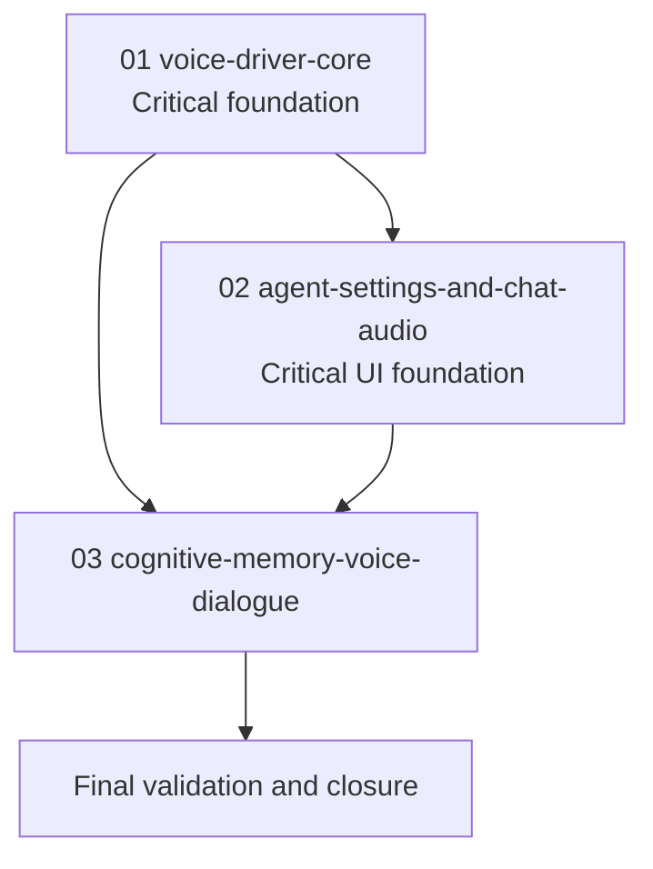

# Phase Plan

## Execution Order

1. `01-01-voice-driver-core`
2. `02-02-agent-settings-and-chat-audio`
3. `03-03-cognitive-memory-voice-dialogue`
4. Final validation and closure

## Subbundle Dependency Map

## Critical Subbundles

| Subbundle | Criticality | Why |
| --- | --- | --- |
| `01-01-voice-driver-core` | Critical foundation | All UI and Cognitive Memory voice behavior depends on stable contracts, exact factory selection, credentials, and OpenAI request behavior. |
| `02-02-agent-settings-and-chat-audio` | Critical UI foundation | Cognitive Memory voice should reuse the same service/settings semantics and browser audio behavior. |
| `03-03-cognitive-memory-voice-dialogue` | Dependent feature | Depends on driver/service/settings and must preserve probe review gates. |

## Phase Gates

| Phase | Entry Gate | Exit Gate |
| --- | --- | --- |
| `01-01-voice-driver-core` | Bundle readiness passed; OpenAI docs source links captured. | New project builds; driver factory and OpenAI request construction unit tests pass; no raw-key persistence; downstream can consume `IAgentVoiceService`. |
| `02-02-agent-settings-and-chat-audio` | Phase 01 exit gate passed. | Settings persist; per-agent voice metadata saves/loads; shared chat panel renders audio controls; normal and floating chat can record/transcribe/send/speak in browser proof. |
| `03-03-cognitive-memory-voice-dialogue` | Phase 01 and 02 exit gates passed. | Probe workbench supports voice ask/answer/correction confirmation; ambiguous confirmation does not store; correction uses `RecordFeedbackAsync`; browser proof captured. |
| Closure | All subbundle exit gates passed. | Targeted tests and build pass or failures are explicitly unrelated; execution report and browser analytics are complete; final validator passes. |

## Execution Notes

- Do not start UI implementation if phase 01 driver contracts still need shape changes.
- Do not start Cognitive Memory voice storage until per-agent/general settings and the shared service are stable.
- Keep browser proof logs in `reviews/01-execution-report.md` and place screenshots under `evidence/`.
