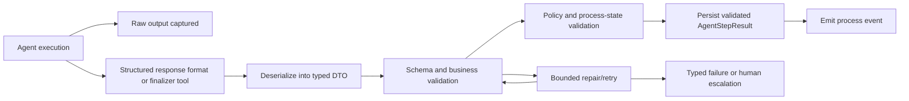

# Target Solution

## Pipeline

## Boundaries

- `CanDoItAll.AgentFramework.Models` should own portable DTO contracts that can be serialized and reused by core, MAF runtime, process automation, and tests.
- `CanDoItAll.AgentFramework.Core` should own execution abstractions and structured-output request plumbing.
- `CanDoItAll.AgentFramework.Maf` should translate typed execution options into installed Microsoft Agent Framework APIs.
- `CanDoItAll.Modules.Processes` should consume validated typed process-step outcomes, not free-form assistant markdown.

## Minimal Implementation Strategy

- Add focused typed contracts for `AgentStepResult<TPayload>`, `AgentOutputEnvelope<TPayload>`, validation errors/results, repair/failure/escalation, and process-step decision payloads.
- Add a validator for governed process-step outcomes that enforces status, reason, branch outcome, evidence, and consistency rules.
- Extend runtime execution requests with an optional structured output contract for known critical payloads.
- For process automation, request a structured `ProcessStepOutcomeResult` and validate it before status/branch persistence.
- Keep legacy HTML comment parsing only as non-authoritative compatibility diagnostics or repair input during transition.

## Finalizer Tool Pattern

- The architecture should include a finalizer-tool abstraction for future critical decision agents.
- Process-step finalization can use the same typed `ProcessStepOutcomeResult` payload.
- Missing finalizer invocation must be treated as invalid when a run is configured to require a finalizer.

## Provider Limitations

- Microsoft Learn and installed XML both state `ResponseFormat` is a request that client implementations may ignore.
- Validation, retry, and typed failure are therefore mandatory even when `ResponseFormat` is configured.
