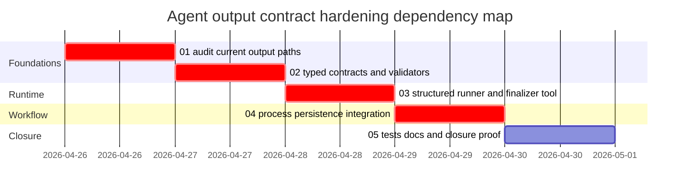

# Phase Plan

## Phase Sequence

1. Complete and record the current-state audit.
2. Add typed output contracts and validators.
3. Add structured runner/finalizer plumbing against the installed Agent Framework API.
4. Integrate validated typed outcomes into process dispatch and persistence.
5. Add tests, documentation, execution proof, and closure audit.

## Subbundle Dependency Map

## Critical Subbundles

- `01-current-state-agent-output-audit`: critical because the implementation must remove the actual unsafe path, not a guessed one.
- `02-typed-output-contracts-and-validation`: critical because downstream runner and process changes must consume these contracts.
- `03-structured-runner-and-finalizer-tool`: critical because it wires contracts into the Agent Framework adapter.
- `04-process-state-persistence-integration`: critical because it prevents unvalidated output from mutating workflow state.

## Phase Gates

- Preparation gate: `python C:\Users\lucys\.codex\skills\candoitall-bundle-preparation\scripts\validate_bundle.py --stage prepared codex\bundles\agent-output-contract-hardening-2026-04-26`
- Subbundle entry gate: confirm prerequisites and exact source references still match the repo.
- Subbundle closure gate: tests or build proof for touched projects, execution report updated, no downstream phase starts on weak proof.
- Final closure gate: `dotnet build`, focused tests, documentation review, raw request closure, and completed bundle validator.
