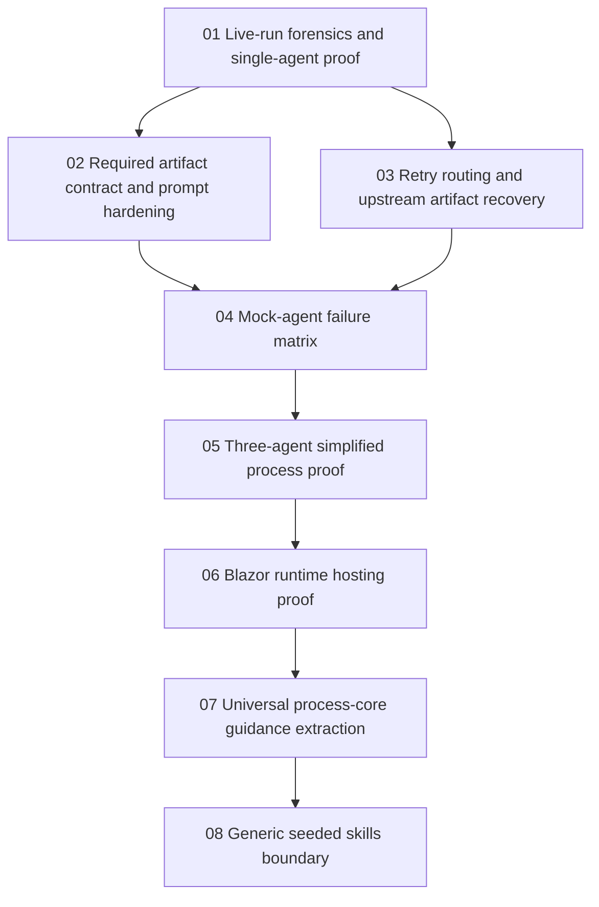

# Phase Plan

## Execution Order

1. `01-live-run-forensics-and-single-agent-proof`
2. `02-required-artifact-contract-and-prompt-hardening`
3. `03-retry-routing-and-upstream-artifact-recovery`
4. `04-mock-agent-failure-matrix`
5. `05-three-agent-simplified-process-proof`
6. `06-blazor-runtime-hosting-proof`
7. `07-universal-process-core-guidance-extraction`
8. `08-generic-seeded-skills-boundary`

## Subbundle Dependency Map

## Critical Subbundles

- `01` is a critical foundation because it establishes the actual failure classification and the single-agent proof boundary.
- `02` is a critical foundation because all later retries and process proof depend on correct artifact obligation behavior.
- `03` is a critical foundation because retrying the wrong owner makes downstream process proof untrustworthy.
- `06` is diagnostic history because later proof showed build/test-only implementation evidence can still leave a generated UI app unusable at runtime.
- `07` is a critical correction because process orchestration must stay universal and must not carry sample-app or framework-specific repair recipes.
- `08` is a critical correction because globally seeded skills must not carry one sample app or one-off workload as default behavior.

## Phase Gates

| Phase | Entry gate | Closure gate | Downstream impact |
| --- | --- | --- | --- |
| 01 | DB and source references available read-only. | Single-agent proof or focused failing test captures the current behavior. | Blocks all later implementation if diagnosis is wrong. |
| 02 | Phase 01 classification accepted. | Required artifact prompt/projection tests pass, including DB-free checklist. | Unlocks mock matrix and simplified process proof. |
| 03 | Phase 01 identifies current vs upstream ownership cases. | Retry-routing tests pass for current-step and upstream missing artifacts. | Prevents false recovery loops in phase 05. |
| 04 | Phases 02 and 03 have stable contracts. | Mock runtime can reproduce and recover observed failure modes. | Provides deterministic proof substrate for phase 05. |
| 05 | Mock matrix is green. | Three-agent process proof passes and records artifact handoff. | Closes bundle without relying on the full rich process. |
| 06 | Prior closure proof is contradicted by generated-app runtime failure. | Runtime/browser proof identifies the process gap. | Diagnostic history for runtime-proof requirements. |
| 07 | User correction rejects sample-specific core process guards. | Process dispatch scans clean, reusable seeds are generalized, focused tests pass, and bundle validation passes. | Restores trust that the same process can govern documents, spreadsheets, applications, and other deliverables. |
| 08 | User correction rejects sample-specific seeded skills. | Seeded skill/resource scans clean, stale built-in inline skills retire generically, focused tests pass, and bundle validation passes. | Restores trust that seeded agents can handle arbitrary app and non-app tasks without sample defaults. |

## Execution Policy

- Do not run the full rich software-delivery process as the first validation.
- Use focused integration tests first.
- Use Playwright only when UI/operator state is materially changed or for the final three-agent proof.
- If a later phase finds missing artifact classification is wrong, reopen phase 02 or 03.
- If a later generated app builds but fails at route startup, reopen phase 06 and require implementation-lane runtime proof before QA or release approval can pass.
- If a repair requires domain-specific advice, add it to the relevant agent, skill, or tool capability instead of process-core dispatch.
