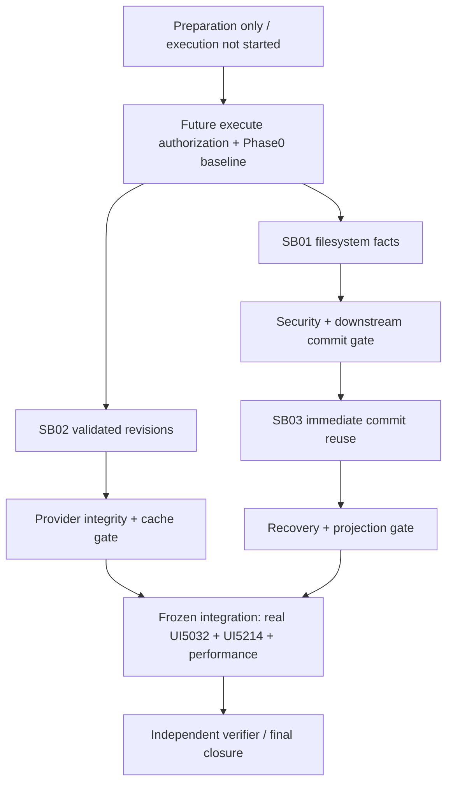

# Phase Plan

## Phase Sequence

0. After a future execute request: confirm source/host identity, backups/rollback and test-fixture ownership; freeze baseline protocol; collect real UI baseline and focused characterization. No implementation before this baseline gate.
1. Execute SB01 and its security/downstream persistence gate.
2. Execute SB02 and its integrity/cache/composition gate. It may run alongside SB01 only with separate source ownership and isolated tests; never concurrently mutate shared live fixtures.
3. Execute SB03 after SB01. Freeze integrated source/binaries only after SB02 also passes.
4. Run the combined Playwright MCP matrix on 5032 and5214 plus paired performance/recovery checks. This is a validation phase, **not recommendation4**.
5. Independent verifier reviews governed artifacts, traceability, raw-note closure and source diff. Close only when both behavior and performance gates pass.

## Subbundle Dependency Map

## Critical Subbundles

- SB01: Governed; filesystem security foundation; downstream store commit smoke must pass before SB03.
- SB02: Governed; validated provider availability foundation; shared/local real conversation proof depends on it.
- SB03: Governed; durability/recovery foundation and owner of combined two-host closure.
- Full manifests apply because the actual boundaries are security/integrity/recovery, not merely because there are several phases.

## Phase Gates

- Preparation: canonical prepared-stage validation, semantic bundle review and no-code/no-runtime diff audit.
- Every entry: reread current sources, verify prerequisites/hashes, focused test discovery and invariant contracts.
- Every closure: independent architecture review; positive and adversarial checks; no skipped mandatory platform case; portable manifests/transcripts.
- Frozen integration: targeted regression union, required builds and real UI/host matrix. No unfiltered solution test by default.
- Final: raw inputs closed honestly, no executed phase left Ready/In progress, source/proof/status agree. If a required benchmark or functional case fails, reopen; do not hide it as residual risk.

## Invalidation And Parallel Safety

SB01 and SB03 must not edit shared filesystem/persistence code concurrently. SB02's provider work may be independent but shared test/build artifacts and live instances need serial ownership. Any prerequisite reopen invalidates dependent binaries, browser sessions and timing proof as described in the risk register.

## UI Target Policy

1920×1080 desktop, both exact origins, existing components/layout. Detailed matrix and scroll/overlay proof in `live-ui-validation.md`.
