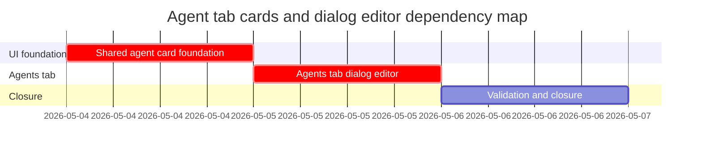

# Phase Plan

## Phase Sequence

1. Prepare and validate this bundle.
2. Execute `01-shared-agent-card-foundation`; prove the shared card preserves switch-dialog behavior.
3. Execute `02-agents-tab-dialog-editor`; prove the Agents tab card grid and tabbed dialog editing behavior.
4. Execute `03-validation-and-closure`; run focused tests/build, browser proof, raw-note closure, and final validator.

## Subbundle Dependency Map

- `02-agents-tab-dialog-editor` depends on the shared card API and styling from `01-shared-agent-card-foundation`.
- `03-validation-and-closure` depends on both implementation subbundles being completed or explicitly reopened.

## Critical Subbundles

- `01-shared-agent-card-foundation` is a critical UI foundation because both chat and Agents tab card behavior depend on it.
- `02-agents-tab-dialog-editor` is a critical UI and behavior foundation because it moves the technical editor into modal tabs and owns persistence-sensitive fields.

## Phase Gates

- Gate after preparation: run `validate_bundle.py --stage prepared` and manually audit raw-note coverage, dependencies, and proof expectations.
- Gate before subbundle 01: confirm the existing card, switch dialog, and switch-dialog tests are understood.
- Gate after subbundle 01: switch-dialog tests pass and both surfaces can share the card without duplicate markup.
- Gate before subbundle 02: subbundle 01 is completed and no card API proof gaps remain.
- Gate after subbundle 02: component tests prove card double-click opens dialog, save still works, capability assignment is visible, and text areas are full-width/tall.
- Gate after subbundle 03: build/tests and browser proof are recorded, raw notes are closed, and final validators pass.
