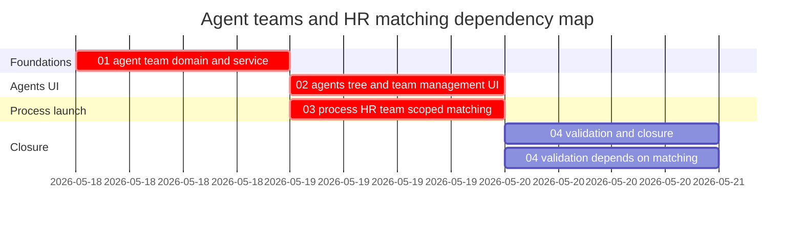

# Phase Plan

## Execution Order

1. Implement the AgentFramework team model and service contract.
2. Add Agents tab tree filtering and team management modal.
3. Add selected-team process HR matching and out-of-team markers.
4. Run tests, browser proof, raw-note closure, and final bundle synchronization.

## Subbundle Dependency Map

## Critical Subbundles

- `01-agent-team-domain-and-service` is a critical foundation because every UI and matching feature depends on durable team membership.
- `02-agents-page-tree-and-team-management-ui` is a critical UI foundation because it proves the management surface and multi-select modal requested by the architect.
- `03-process-hr-team-scoped-matching` is process-critical because a wrong score or marker could silently staff the wrong delivery agents.

## Phase Gates

- Preparation gate: run `python C:\Users\dell\.codex\skills\candoitall-bundle-preparation\scripts\validate_bundle.py codex\bundles\agent-teams-management-and-hr-matching --profile initiative --stage prepared`.
- Subbundle 01 entry gate: current-state files have been inspected; no implementation should start without confirming catalog normalization and service contract locations.
- Subbundle 01 closure gate: targeted persistence/service tests pass and agent deletion prunes team memberships.
- Subbundle 02 entry gate: subbundle 01 closure proof exists.
- Subbundle 02 closure gate: component test and browser screenshot prove tree filtering and open membership modal.
- Subbundle 03 entry gate: subbundle 01 closure proof exists and process launch service/UI files are current.
- Subbundle 03 closure gate: integration/component tests prove selected-team matching, out-of-team fallback, and candidate markers.
- Final closure gate: all raw notes are marked solved/partial/not solved, targeted tests and browser proof are recorded, and completed-stage bundle validation passes or documented blocker exists.
