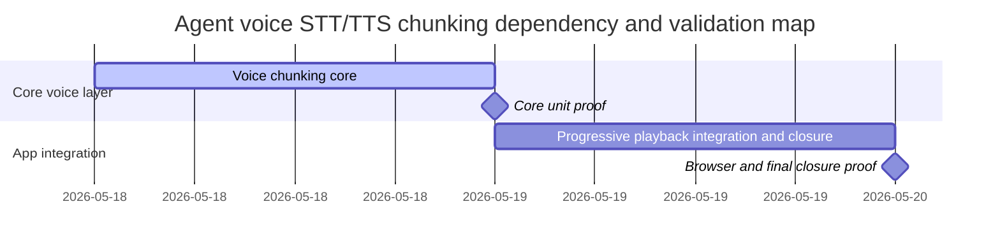

# Phase Plan

## Phase Sequence

1. Validate and implement `01-voice-chunking-core`.
2. Run targeted unit tests for service, chunker, STT, and driver request behavior.
3. Validate and implement `02-progressive-playback-integration-and-closure`.
4. Run targeted unit tests again, then build or broaden tests if compilation surfaces wider issues.
5. Run browser validation for the voice UI route when the local app host is available.
6. Close raw notes one by one and run final bundle validation.

## Subbundle Dependency Map

## Critical Subbundles

- `01-voice-chunking-core` is a critical foundation. It owns provider-neutral contracts, TTS text chunking, progressive synthesis, and ordered STT aggregation.
- `02-progressive-playback-integration-and-closure` depends on subbundle 01 proving that callers can remain provider-neutral and consume chunks in order.
- Deeper validation for subbundle 01: targeted unit tests must prove multiple TTS driver calls, ordered STT aggregation, and preserved identifier-preprocessor metadata before UI integration starts.

## Phase Gates

- Gate after preparation: run `python codex\skills\bundles\candoitall-bundle-preparation\scripts\validate_bundle.py codex\bundles\agent-voice-stt-tts-chunking --profile feedback --stage prepared`.
- Gate before subbundle 01: confirm source references exist and previous voice bundles are completed.
- Gate after subbundle 01: targeted unit tests for voice chunking and STT/TTS service behavior pass; otherwise do not start UI integration.
- Gate before subbundle 02: confirm subbundle 01 closure gate passed and no UI caller needs provider-specific chunk logic.
- Gate after subbundle 02: all known voice callers use the progressive path or have a documented short-sample exception; browser queue playback is covered by code review and browser proof when possible.
- Gate before final closure: run completed-stage bundle validation, update execution report rows, and close every raw note.
