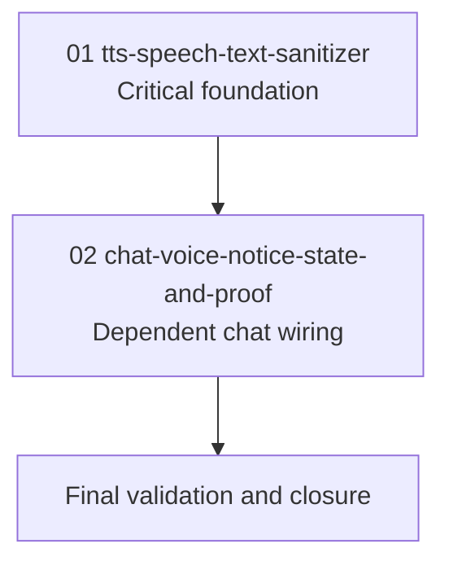

# Phase Plan

## Execution Order

1. `01-01-tts-speech-text-sanitizer`
2. `02-02-chat-voice-notice-state-and-proof`
3. Final validation and closure

## Subbundle Dependency Map

## Critical Subbundles

| Subbundle | Criticality | Why |
| --- | --- | --- |
| `01-01-tts-speech-text-sanitizer` | Critical foundation | All caller behavior depends on the service producing stable spoken text and accurate metadata about whether IDs were omitted and whether the notice was included. |
| `02-02-chat-voice-notice-state-and-proof` | Dependent UI/runtime wiring | Depends on subbundle 01 metadata to avoid repeating the notice per conversation while preserving visible text. |

## Phase Gates

| Phase | Entry Gate | Exit Gate |
| --- | --- | --- |
| `01-01-tts-speech-text-sanitizer` | Bundle readiness passed; exact source references exist. | Sanitizer/service unit tests pass; driver receives sanitized text; full GUIDs and safe truncated IDs are omitted; ordinary text is preserved. |
| `02-02-chat-voice-notice-state-and-proof` | Phase 01 exit gate passed and synthesis result exposes notice metadata. | Normal chat, floating chat, and Cognitive Memory probe voice pass suppression option correctly; notice is not repeated for the same session; targeted component/browser proof captured. |
| Closure | Both subbundle exit gates passed. | Targeted tests and build pass; raw-note closure complete; final bundle validator passes. |

## Execution Notes

- Do not start chat-state wiring until the service returns metadata that identifies whether the notice was spoken.
- Do not remove IDs from visible text.
- Store browser proof and validation evidence under `evidence/` and summarize it in `reviews/01-execution-report.md`.
