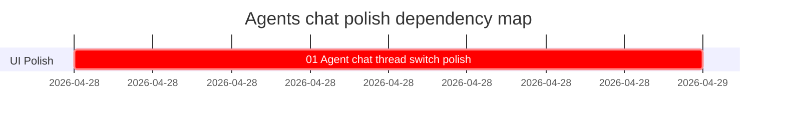

# Phase Plan

## Phase Sequence

1. Prepare the thread-title persistence and favourite tag foundation.
2. Tighten the left rail thread card and editable chat header.
3. Extend the switch-agent modal with search, tag filtering, and favourite sorting.
4. Validate with component tests, build, and Playwright screenshots.

## Subbundle Dependency Map

## Critical Subbundles

- `01-agent-chat-thread-switch-polish` is the only critical subbundle because all requested behavior is on the same Agents chat interaction surface.

## Phase Gates

- Preparation gate: requirements map to the screenshot/request and shared component choices are confirmed.
- Entry gate: existing Agents chat components and service methods have been inspected.
- Closure gate: build, focused tests, main-page screenshot, switch-modal screenshot, and visual review all pass or document an explicit blocker.
