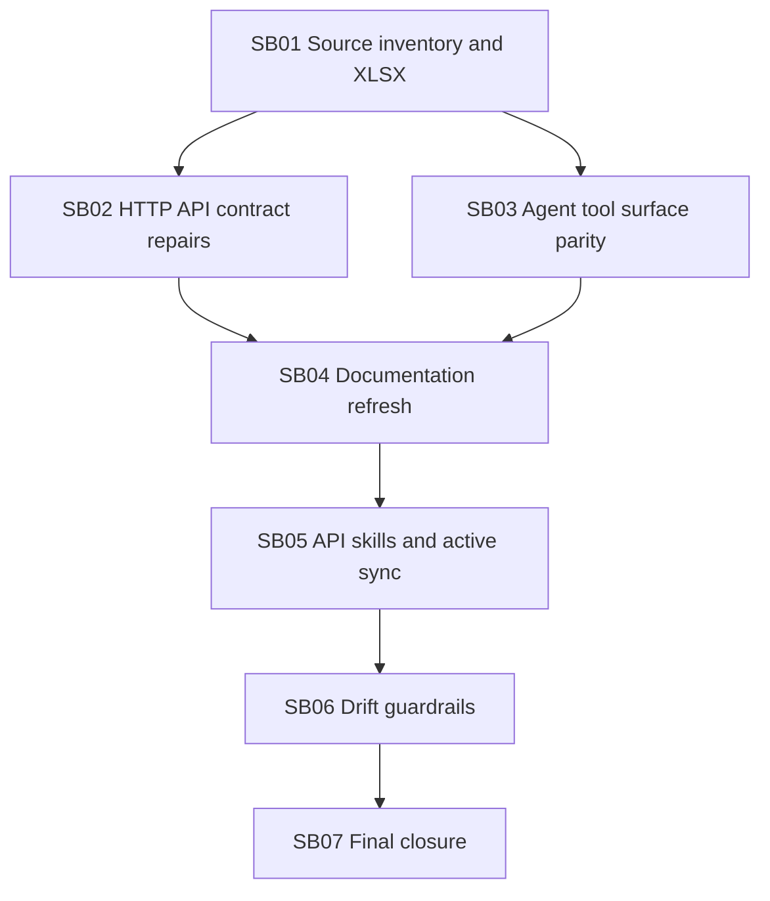

# Phase Plan

## Phase Sequence

1. SB01 builds and verifies the source-of-truth inventory and workbook.
2. SB02 repairs API contract/OpenAPI/focused test coverage for high-risk missing route assertions.
3. SB03 resolves process and project-structure agent runtime tool parity or records explicit HTTP-only boundaries.
4. SB04 refreshes docs after contract/tool decisions are known.
5. SB05 refreshes repo-managed API skills and synchronizes active local skill copies.
6. SB06 adds drift guardrails so route/docs/skills gaps become visible in future work.
7. SB07 performs closure validation, raw request audit, and final handoff.

## Subbundle Dependency Map

- If SB01 changes route counts, every downstream subbundle must re-check its inputs before editing.

## Critical Subbundles

- SB01 is a critical foundation because it defines the source counts and gap map.
- SB02 is a critical foundation because docs and skills must not document routes that are missing from OpenAPI or broken in focused API tests.
- SB03 is a critical foundation because agent skill claims depend on runtime tool reality.
- SB06 is a critical closure guardrail because it prevents the same drift pattern from recurring.

## Phase Gates

- Gate after preparation: run `validate_bundle.py --profile initiative --stage prepared` and repair failures.
- Gate before SB02/SB03: confirm the workbook route counts still match source.
- Gate after SB02: focused OpenAPI/API contract test proof exists.
- Gate after SB03: tool policy, descriptor, approval, and runtime tests exist or HTTP-only exceptions are documented.
- Gate after SB04: docs route/DTO/provider claims are source-backed.
- Gate after SB05: repo and active local skill hashes match.
- Gate after SB06: drift check/test fails on missing high-priority route coverage and passes with current updates.
- Gate before SB07 closure: rerun validators, focused tests, workbook generation, `git diff --check`, raw note traceability, and residual risk review.
