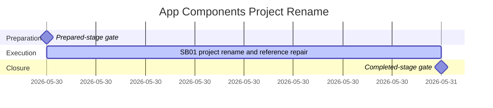

# Phase Plan

## Execution Order

1. Run the prepared-stage bundle validator and repair any bundle gaps.
2. Execute SB01: rename the project directory/file/identity and repair direct consumers.
3. Capture proof under `bundle://proof/SB01/`.
4. Run the completed-stage bundle validator and close the raw request.

## Subbundle Dependency Map

- SB01 has no implementation prerequisite beyond passing the preparation gate.

## Critical Subbundles

- SB01 is a critical foundation because it changes project identity, build graph inputs, and compiled namespace consumers.
- SB01 must include semantic adequacy evidence, a proof manifest, changed-file hashes, source assertions, targeted build/test transcripts, stale-reference proof, and anti-stub audit before closure.

## Phase Gates

- Gate after preparation: `python codex/skills/bundles/candoitall-bundle-preparation/scripts/validate_bundle.py codex/bundles/app-components-rename-v1 --profile initiative --stage prepared`.
- Gate before SB01: confirm raw note `N001` through `N003` are owned by SB01 and exact source references still exist.
- Gate after SB01: targeted project build, component test project run, stale-reference search, anti-stub audit, and proof manifest must all exist.
- Gate before closure: completed-stage bundle validator passes and raw note closure is `Solved`.
