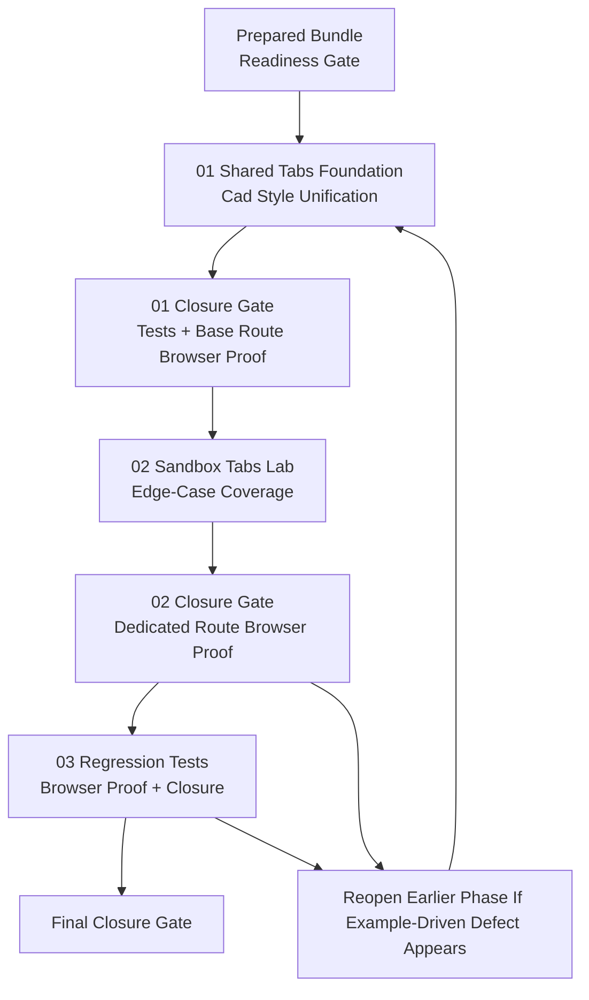

# Phase Plan

## Phase Sequence

1. Run the readiness gate on the prepared bundle and repair any validator findings before touching component code.
2. Execute subbundle 01 to establish the shared tabs contract, styling source-of-truth, and baseline proof.
3. Execute subbundle 02 to add the dedicated tabs sandbox lab and edge-case coverage.
4. Execute subbundle 03 for regression tests, browser proof, raw-note closure, and final bundle synchronization.
5. If subbundle 02 or 03 exposes a shared-component defect, reopen subbundle 01 or 02 immediately, repair it, rerun the prepared validator if the bundle contract changed materially, and then resume the dependent phase.
6. End with the final closure validator plus a note-by-note audit against the original request and thread screenshots.

## Subbundle Dependency Map

- Subbundle 01 unlocks all later work because it owns the shared component API, class contract, and style source-of-truth.
- Subbundle 02 depends on subbundle 01 because edge-case examples must reveal shared component issues rather than work around them.
- Subbundle 03 depends on both earlier phases because final proof is only trustworthy if the shared contract and dedicated sandbox surface are already stable.

## Critical Subbundles

- `subbundles/01-shared-tabs-foundation-and-cad-style-unification`
- Why critical:
- It owns the removal of the shared `zy-*` dependency.
- It owns the appearance-parameter contract requested by the user.
- If it is wrong, every later screenshot and sandbox example becomes untrustworthy.
- Required deeper validation before downstream work:
- focused component tests
- a browser pass on the existing navigation route before the new sandbox route work begins
- explicit verification that the rendered shared component no longer depends on the old selector family

## Phase Gates

- Gate after preparation:
- run `validate_bundle.py --stage prepared`
- run the bundle-validator audit
- repair any missing heading, source-reference, or traceability defects before implementation
- Gate before subbundle 01:
- confirm the source references still exist
- confirm Tailwind source files and the scoped CSS file are the actual affected surfaces
- Gate after subbundle 01:
- confirm component tests passed
- confirm browser proof on the baseline route passed
- confirm downstream work can trust the new shared contract
- Gate before subbundle 02:
- confirm subbundle 01 is `Completed`
- confirm the shared contract proof is strong enough for discovery examples
- Gate after subbundle 02:
- confirm the dedicated tabs route exists
- confirm desktop and narrower-width screenshots are reviewed
- reopen 01 or 02 immediately if the example lab reveals a foundational defect
- Gate before subbundle 03:
- confirm both prior phases are `Completed`
- confirm the dedicated tabs route is the proof surface for final browser closure
- Gate before closure:
- rerun validators
- finish raw-note closure table
- ensure no executed subbundle remains `Ready` or `In progress`
