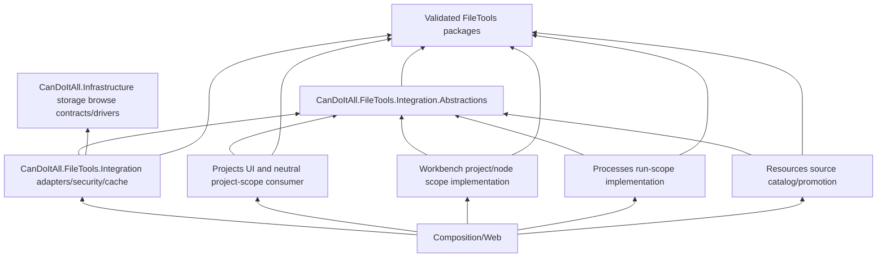

# Target Solution

## End State

CanDoItAll exposes authorized semantic file scopes through FileTools without making FileTools know the app and without making Infrastructure know FileTools. Storage drivers provide native bounded browsing; an outer integration layer maps native storage facts to FileTools providers, applies authorization/cache/handle policy, and supplies browser-session-independent content/save adapters. Modules own domain meaning and focused UI. Composition wires concrete implementations.

## Layering

## Target Projects

### `CanDoItAll.FileTools.Integration.Abstractions`

Small SDK-free-to-main boundary under `src/Integration`. It may reference FileTools Abstractions/Core as required by returned session/provider contracts. It owns typed semantic scope/access/handle contracts and the interfaces modules consume. It must not reference Infrastructure, Web, persistence, EF, or any module.

### `CanDoItAll.FileTools.Integration`

Outer implementation under `src/Integration`. It references Integration.Abstractions, Infrastructure, and only the FileTools packages needed for adapters/runtime. It owns storage-to-FileTools mapping, session/content/save factories, handle registry, authorization orchestration, cache decorator, revision service, and feature DI extension. It must not reference module projects.

### Existing Projects

- Infrastructure owns native browse contracts, provider implementations, settings, and registration.
- Projects consumes neutral scope/session contracts and owns project UI projection/panes/dialog.
- Workbench implements project aggregate/node scope semantics and owns the canvas window/action coordinator.
- Processes owns process-run root resolution and run scope.
- Resources owns source catalog and promotion.
- Composition/Web owns implementation registration, auth-context adaptation, and HTTP effect endpoints.

## Effects

- Browse/search/stat return descriptive bounded values.
- Item activation produces host intent only.
- Content/download/save require a current access context, re-resolution, handle validation, and operation authorization.
- Save bumps catalog revision only after persistence acknowledgement.
- Logs use actor/source/binding/operation correlation identifiers and mask paths, tokens, credentials, and content.

## UI Target

Maximized desktop at `1900x1200`; minimum supported proof viewport `1440x900`. Dialog/floating components may be smaller inside that desktop but are not separate responsive breakpoints. FileBrowser `Standard`, `Compact`, or `Minimal` is selected explicitly by host surface.

FileBrowser modes apply only to collection browsing. A Project Structure node that already identifies one authorized image/PDF opens the existing dialog with FileInteraction directly; it does not select any FileBrowser mode or construct browser/session state. All browser providers obey `architecture/10-performance-and-scale.md` so a bounded page also has bounded provider work and retained state.

## Non-Goals

- No FileTools source dependency, distributed cache, mobile layout, full project-structure refactor, Office editing suite, or implicit support for every provider operation.
