# Phase Plan

## Phase Sequence

1. Re-entry and reproducible FileTools package baseline (`SB01`).
2. Storage foundation (`SB02-SB04`).
3. Storage architecture cleanup gate (`SB05`).
4. FileTools integration backbone (`SB06-SB08`).
5. Backbone architecture cleanup gate (`SB09`).
6. Single project-files UI pilot (`SB10`).
7. Pilot architecture/UX cleanup gate (`SB11`).
8. Progressive user stories (`SB12-SB16`), one surface at a time.
9. Expansion cleanup gate (`SB17`).
10. Final regression/security/closure (`SB18`).

## Subbundle Dependency Map

```mermaid
flowchart LR
    P["Prepared bundle"] --> S1["SB01 Re-entry/package baseline"]
    S1 --> S2["SB02 Native browse contracts"]
    S2 --> S3["SB03 Filesystem browse"]
    S2 --> S4["SB04 IPFS/FTP browse"]
    S3 --> S5["SB05 Storage cleanup gate"]
    S4 --> S5
    S5 --> S6["SB06 Package/boundaries"]
    S6 --> S7["SB07 Authority/handles/effects"]
    S7 --> S8["SB08 Cache/revision"]
    S8 --> S9["SB09 Backbone cleanup gate"]
    S9 --> S10["SB10 Project search/browser/interaction pilot"]
    S10 --> S11["SB11 Pilot cleanup gate"]
    S11 --> S12["SB12 Portfolio/card files"]
    S12 --> S13["SB13 Project Structure window"]
    S13 --> S14["SB14 Process-run files"]
    S14 --> S15["SB15 Resources/promotion"]
    S15 --> S16["SB16 View/edit migration"]
    S16 --> S17["SB17 Expansion cleanup gate"]
    S17 --> S18["SB18 Final closure"]
    S18 --> C["Completed bundle gate"]
```

SB03 and SB04 may run independently after SB02 only when they do not edit the same shared contract/path/transport files. Their closure still converges at SB05. UI stories are deliberately sequential because each proves the integration in a more complex host and may reopen a foundation.

Large-source performance is part of the critical path: SB02 defines typed bounds/capabilities, SB03 removes full-directory page-one work, SB04 proves streaming/bounded remote transport, and SB05 blocks FileTools/UI adoption unless those proofs pass. SB10 validates the first real browse/search path. SB13/SB16 preserve the direct known-asset fast path. SB18 reruns representative regression envelopes.

## Critical Subbundles

| SB | Proof tier | Why critical | Required dependent check |
| --- | --- | --- | --- |
| 01 | Standard | establishes usable SDK/packages/source anchors | SB02 builds against recorded baseline |
| 02 | Behavioral | selects native contract/capability/settings model | both filesystem and remote fake drivers implement it without lies |
| 03 | Governed | filesystem/root/content security and large-directory boundary | outer adapter/pilot read a replaced file and large page within structural budgets |
| 04 | Behavioral | remote capability/freshness/streaming truth | outer adapter maps bounded IPFS/FTP positives and unsupported negatives without connection churn/full buffering |
| 05 | Standard | blocks architecture/performance debt before integration | SB06 reference plan and accepted scale envelope |
| 06 | Behavioral | sets package/project dependency direction | composition can load packages/assets and fake provider |
| 07 | Governed | actor/runtime authorization and effects boundary | SB10 browser activation opens content only through handle |
| 08 | Governed | data isolation/cache/revision correctness | pilot and one mutation use Disabled/revision policy correctly |
| 09 | Behavioral | final pre-UI architecture trust | SB10 entry gate passes with current snapshots |
| 10 | Behavioral | first real user-visible and large-source integration | SB12 may start only after SB11 reviews behavior, counters, and direct interaction handoff |
| 11 | Behavioral | pilot quality/progression decision | first broader project story runs on accepted seam |
| 15 | Governed | persists promoted storage resource | FileInteraction/resource reopen uses persisted stable identity |
| 16 | Governed | direct view/mutating edit/save migration | final regression proves no duplicate/unsafe/browser-on-known-file path |
| 18 | Governed | claims cross-surface completion | raw inputs and all downstream smoke agree |

Other UI story subbundles are Behavioral and independently closable; their own architecture review gate is mandatory even though SB17 performs the wave-wide cleanup.

## Phase Gates

### Prepared -> SB01

- Prepared validator and manual readiness pass.
- No product implementation authored during preparation.
- Current source pins and known tool/environment gaps are explicit.

### SB01 -> Storage

- FileTools SDK requirement is satisfied; clean restore/build/test/pack/validate and package hashes are current.
- Main baseline and scoped CodeAnalytics/components availability are refreshed.
- If Components MCP remains unavailable, Storage may proceed but any UI phase remains blocked.

### Storage -> SB05

- Native contracts/settings/registry plus filesystem/IPFS/FTP behavior pass assigned positive/negative tests.
- No FileTools dependency in Infrastructure, no false capability, no secret/path disclosure.
- Large-directory page-one work/state, remote connection/streaming behavior, cancellation, and scoped anti-pattern scan pass the accepted structural envelope.
- SB05 runs C# architecture review and either Passes or reopens SB02-SB04.

### Backbone -> SB09

- Package intake, project boundaries, authorization/handles/endpoints, cache/revision, composition, and dependency proofs pass.
- SB09 runs review/cleanup and one browser-independent dependent smoke. UI remains blocked until Pass.

### Pilot -> SB11

- One real project search/browse/read-only known-file interaction works and negative/stale cases fail correctly.
- Large-source browse/search remains bounded and the activated known-file interaction is browser-session independent.
- Desktop DOM, screenshot, overlay, scroll, console, and network proof is complete.
- SB11 cleans architecture/UX/test debt and issues Pass/Fail; no broader story starts on “pass with missing proof.”

### Expansion -> SB17

- Each story passed its own Behavioral/Governed gate and did not bypass foundations.
- Project Structure image/PDF double-click keeps its dialog with direct FileInteraction and zero FileBrowser calls; collection actions alone open the browser window.
- SB17 removes duplication, reviews large-owner growth, dependency graph, FileInteraction package selection, and cross-story consistency.

### Final Closure

- SB18 governed proof, raw-note audit, completed validator, security red-team, and affected end-to-end regression pass.
- Any incomplete required story is Partially solved/Not solved with an explicit blocker; it is never hidden in risk prose.

## UI Target Policy

- Primary application viewport: `1900x1200`.
- Minimum regression viewport: `1440x900`.
- Dialog/floating window dimensions are tested inside those desktop viewports.
- No small, medium, tablet, narrow-phone, or mobile implementation/validation.
- Reusable BaseLib changes are not planned. If execution changes BaseLib, that becomes a separate scope requiring its full viewport policy.

## Reopen Logic

- Contract/capability leak -> SB02.
- Storage safety/freshness defect -> SB03/SB04.
- Storage/search/content work exceeding declared budgets, full buffering, connection churn, or material performance regression -> SB02-SB05 and affected downstream proof.
- Package/API/dependency mismatch -> SB01/SB06.
- Authority/effect defect -> SB07 and all UI proof invalidated.
- Cache/revision/isolation defect -> SB08 and affected aggregate UI proof invalidated.
- Pilot generic seam gap -> earliest owning foundation, then rerun SB09-SB11.
- Story-specific layout/lifecycle defect -> owning UI SB; generic component/session defect -> SB06/SB10.
- Known-file path constructing/invoking FileBrowser or Project Structure asset double-click regression -> SB07/SB13/SB16 and affected cleanup/final gates.
- Old-owner growth/new partial/cycle -> most recent cleanup gate and owning implementation SB.
