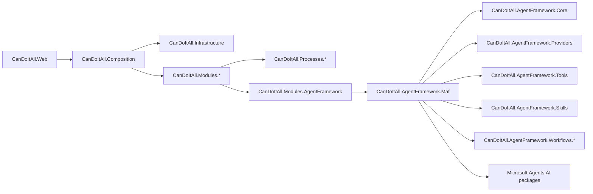
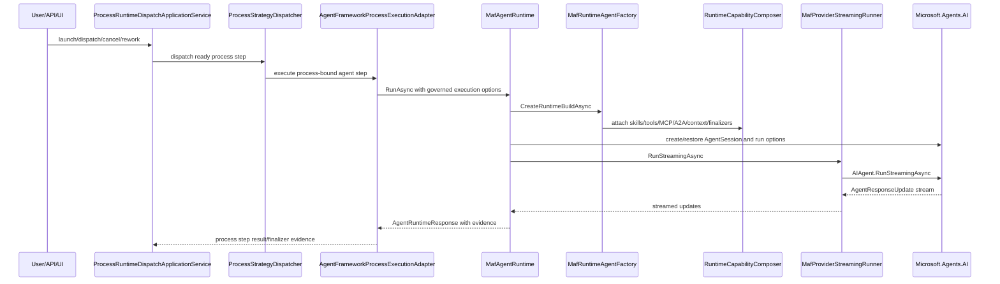
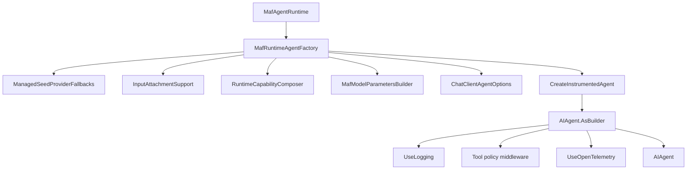
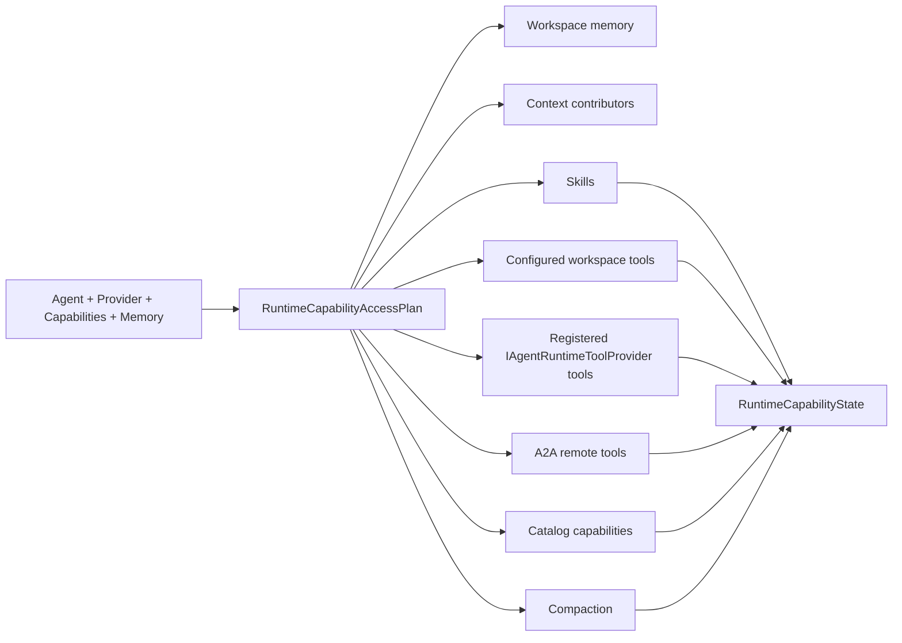
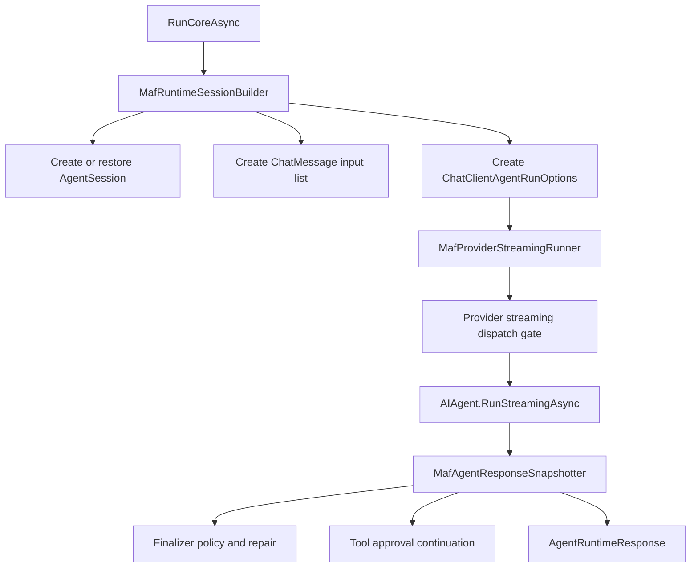
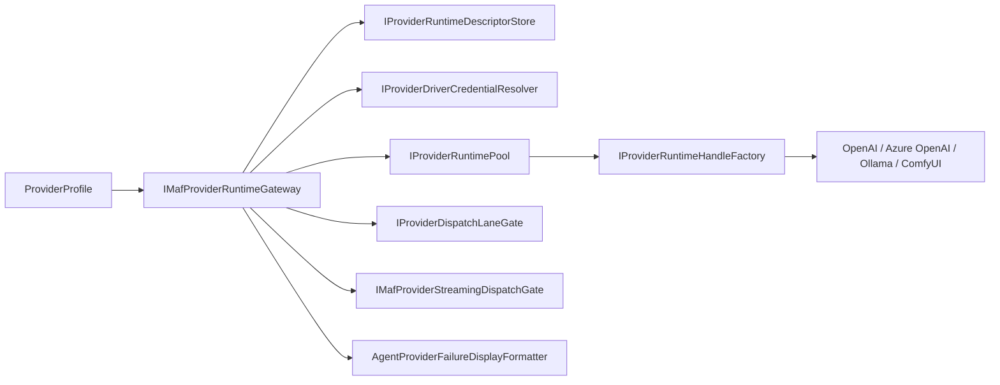

# Current Architecture Map: MAF, Processes, Providers, Workflows, Memory

Generated: 2026-07-07  
Source branch: `memory-providers`

This map is grounded in the reviewed branch files:

- `README.md`
- `CanDoItAll.slnx`
- `docs/processes-maf-providers-implementation-map.md`
- `src/MAF/Common/CanDoItAll.AgentFramework.Maf/CanDoItAll.AgentFramework.Maf.csproj`
- `src/MAF/Workflows/CanDoItAll.AgentFramework.Workflows.MafAdapter/CanDoItAll.AgentFramework.Workflows.MafAdapter.csproj`
- `src/MAF/Common/CanDoItAll.AgentFramework.Maf/Runtime/MafAgentRuntime.cs`
- `src/MAF/Common/CanDoItAll.AgentFramework.Maf/Runtime/MafRuntimeAgentFactory.cs`
- `src/MAF/Common/CanDoItAll.AgentFramework.Maf/Runtime/MafRuntimeSessionBuilder.cs`
- `src/MAF/Common/CanDoItAll.AgentFramework.Maf/Runtime/Capabilities/RuntimeCapabilityComposer.cs`
- `src/MAF/Common/CanDoItAll.AgentFramework.Maf/Runtime/Providers/MafProviderStreamingRunner.cs`

## Executive architecture view

CanDoItAll is currently structured as a modular .NET 10 Blazor application. The MAF integration is intentionally isolated under `src/MAF/**` and exposed to product modules through contracts/adapters.

## Main project families relevant to this update

| Family | Responsibility | Update risk |
| --- | --- | --- |
| `src/MAF/Common/CanDoItAll.AgentFramework.Maf` | Concrete Microsoft Agent Framework adapter and provider execution bridge. | Highest. Directly references `Microsoft.Agents.AI`, `Microsoft.Agents.AI.OpenAI`, `Microsoft.Agents.AI.Workflows`, A2A, Mem0, `Microsoft.Extensions.AI`, tool approval types, sessions, run options, streaming updates, and content types. |
| `src/MAF/Workflows/CanDoItAll.AgentFramework.Workflows.MafAdapter` | Workflow adapter that binds CanDoItAll workflow contracts to MAF workflows. | High. Direct references to `Microsoft.Agents.AI.Workflows` and `Microsoft.Extensions.AI.Abstractions`. |
| `src/MAF/Common/CanDoItAll.AgentFramework.Core` | Internal runtime contracts, agent definitions, execution options, finalizer/structured-output contracts. | Medium. Compile breaks may propagate here only if type aliases or adapters need internal contract adjustments. Avoid product semantic changes. |
| `src/MAF/Common/CanDoItAll.AgentFramework.Providers` | Provider profile descriptors, feature matrix, runtime profile/service model. | Medium. Dependency floors may affect provider driver behavior; preserve current OpenAI/Azure/Ollama/ComfyUI gates. |
| `src/Modules/CanDoItAll.Modules.Processes` | Process module UI/DI and `AgentFrameworkProcessExecutionAdapter`. | Medium. Process execution depends on MAF behavior but should not be redesigned. |
| `src/Processes/**` | Generic process runtime, persistence, projections, drivers. | Low to medium. Only update tests/adapters if existing MAF result semantics change. |
| `src/Memory/**` and `src/Modules/CanDoItAll.Modules.Memory` | Memory providers and cognitive memory branch work. | Low in phase 1 unless Mem0/A2A package compatibility requires compile fixes. |

## Process-to-agent execution path

## Current MAF runtime responsibilities

`MafAgentRuntime` is the primary runtime facade and implements `IAgentRuntime`. Its current responsibilities include:

1. Resolve provider/model behavior and retry without temperature for models/transports that reject explicit temperature.
2. Prepare input attachments and image-analysis model switching.
3. Build Microsoft Agent Framework agents and sessions.
4. Attach capabilities:
   - built-in workspace tools,
   - template-backed skills,
   - MCP descriptors,
   - local and hosted tools,
   - A2A tools,
   - context providers,
   - registered first-party runtime tool providers.
5. Enforce approval and tool policy gates.
6. Stream provider responses.
7. Snapshot tool calls, MCP tool calls, tool approval requests, and response updates.
8. Capture finalizer tool invocations and synthesize governed structured output.
9. Persist/restore runtime session state for approval continuation where supported.
10. Record usage observations, context manifests, finalizer traces, and tool traces.

## Runtime build chain

## Capability composition chain

`RuntimeCapabilityComposer` is the most likely compile-break hotspot after the package update because it references MAF skills, compaction, context providers, A2A tools, MCP, registered runtime tool providers, workspace tools, and provider-native tools.

## Session and streaming chain

## Provider runtime boundary

The provider layer should remain behind CanDoItAll provider abstractions. The update must not hardwire OpenAI-only behavior into process or workflow modules.

## Process boundary invariants

These invariants must survive the package update:

1. Processes remain product/runtime workflows, not MAF workflows by default.
2. `CanDoItAll.Processes.*` remains generic and should not reference concrete Microsoft Agent Framework packages.
3. Product tools enter MAF through `IAgentRuntimeToolProvider` implementations.
4. Current direct first-party runtime tool providers are:
   - `ProjectStructureAgentRuntimeToolProvider`
   - `ImageGenerationAgentRuntimeToolProvider`
5. There is currently no direct `ProcessAgentRuntimeToolProvider`.
6. Process execution should continue through:
   - `/api/processes`,
   - governed process execution adapters,
   - project-structure bridge tools.

## Current API route baseline to preserve

The current process API baseline is narrow:

| Method | Route |
| --- | --- |
| `GET` | `/api/processes/contract` |
| `POST` | `/api/processes/launch/check` |
| `POST` | `/api/processes/launch` |
| `POST` | `/api/processes/runs/{runId}/dispatch` |
| `POST` | `/api/processes/runs/{runId}/cancel` |
| `POST` | `/api/processes/runs/{runId}/steps/{stepInstanceId}/rework` |
| `GET` | `/api/processes/live` |
| `GET` | `/api/processes/runs/{runId}` |
| `GET` | `/api/processes/runs/{runId}/history` |

Do not resurrect old routes or docs in this package-update pass.

## Known gap not to solve in phase 1

| Gap | Why it matters | Phase-1 decision |
| --- | --- | --- |
| No concrete `ProcessAgentRuntimeToolProvider` | Some historical docs/tests may mention direct `processes_*` runtime tools. | Do not add it. Keep current HTTP/API/adapter bridge semantics. |
| In-memory process dispatch queue | Durability issue under restart. | Out of scope for package update. |
| Projection freshness | Runtime correctness depends on catch-up calls. | Validate existing behavior; do not redesign. |
| Provider handle invalidation | Descriptor upsert/pool invalidation may need stronger proof. | Run focused tests; do not redesign. |
| MAF new features | New MAF releases include skills, FileAccess/FileMemory, workflow durability, HITL and hosting improvements. | Document for next phase only. |
