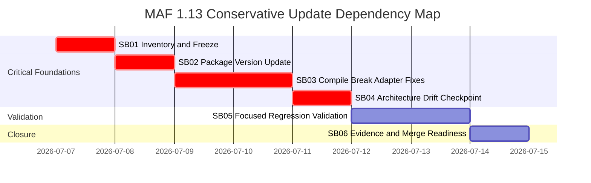

# Phase Plan

## Phase Sequence

1. `SB01 Inventory and Freeze`
2. `SB02 Package Version Update`
3. `SB03 Compile Break Adapter Compatibility`
4. `SB04 Architecture Drift Checkpoint`
5. `SB05 Focused Regression Validation`
6. `SB06 Evidence and Merge Readiness`

## Subbundle Dependency Map

- `SB02` may not start until `SB01` records baseline package/build state.
- `SB03` may not start until `SB02` records package decisions, restore result, and preview package handling.
- `SB05` may not start until `SB04` passes or records a blocker.
- `SB06` may not close if any critical proof manifest or execution row is missing.

## Critical Subbundles

- `SB01` is critical because it distinguishes pre-existing failures from package-induced failures.
- `SB02` is critical because package version decisions constrain all compile fixes.
- `SB03` is critical because adapter fixes can weaken approvals, finalizers, provider gates, session state, or context evidence.
- `SB04` is critical because it blocks architecture drift before broader tests can produce false confidence.

Critical subbundles must require:

- Semantic Adequacy Gate proof.
- Artifact-backed `proof/SBxx/manifest.md`.
- `proof/SBxx/semantic-invariants.md` or `.json`.
- Source assertions and command transcripts.
- Anti-stub audit.
- Reopen decision for downstream work.

## Phase Gates

- Prepared gate: run `validate_bundle.py --stage prepared --profile initiative`.
- Entry gate for every subbundle: verify prerequisite subbundle status, required inputs, exact source refs, and no user-requested scope change.
- Closure gate for `SB01`: baseline package and failure inventory recorded.
- Closure gate for `SB02`: package-only diff and restore outcome recorded.
- Closure gate for `SB03`: build result plus source assertions for governance invariants.
- Closure gate for `SB04`: diff and architecture review passes before test expansion.
- Closure gate for `SB05`: focused test proof plus skip/replacement justifications.
- Closure gate for `SB06`: evidence doc, raw-note closure, final scans, and no hidden unresolved gaps.
