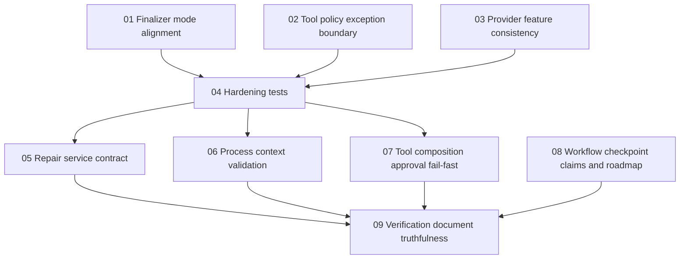

# Phase Plan

This plan extends the prepared bundle with the execution tracking required by the bundle execution workflow. The existing `requirements/requirements.md`, `audit/current-state-audit.md`, and subbundle READMEs remain the source of truth for implementation details.

## Execution Order

| Phase | Subbundle | Status | Critical foundation | Requirements |
|---|---|---|---:|---|
| 01 | `01-finalizer-runtime-mode-alignment` | Completed | Yes | R01, R02 |
| 02 | `02-tool-policy-exception-boundary` | Completed | Yes | R03 |
| 03 | `03-provider-feature-consistency` | Completed | Yes | R04, R05 |
| 04 | `04-hardening-test-suite-reconciliation` | Completed | Yes | R06, R07, R12 |
| 05 | `05-repair-service-contract` | Completed | No | R08 |
| 06 | `06-process-context-output-validation` | Completed | Yes | R09 |
| 07 | `07-tool-composition-approval-failfast` | Completed | No | R10 |
| 08 | `08-workflow-checkpoint-claims-and-roadmap` | Completed | No | R11 |
| 09 | `09-verification-document-truthfulness` | Completed | Yes | R06, R12 |

## Dependency Map

## Gate Rules

- Phase 01 must pass finalizer-mode proof before any verification document can claim hardening coverage.
- Phase 02 must pass policy-exception proof before tool-composition validation can rely on block diagnostics.
- Phase 03 must pass provider-matrix and transport round-trip proof before approval/tool capability decisions are trusted.
- Phase 04 must prove that the focused hardening tests exist and are discoverable.
- Phase 06 must prove process-context validation without introducing markdown/text fallbacks.
- Phase 09 is the final documentation and release-proof phase and cannot close until all prior applicable proof is recorded.
