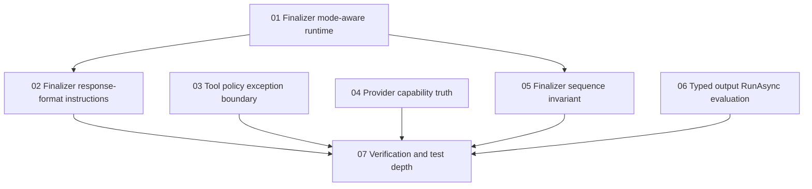

# Phase Plan

This execution plan normalizes the round2 bundle into explicit implementation phases. The root README, requirements, audit notes, and subbundle READMEs remain the source of truth for scope.

## Execution Order

| Phase | Subbundle | Status | Critical foundation | Requirements and notes |
|---|---|---|---:|---|
| 01 | `01-finalizer-mode-aware-runtime` | Completed | Yes | R01, F01 |
| 02 | `02-finalizer-response-format-instruction-consistency` | Completed | Yes | R02, F02 |
| 03 | `03-tool-policy-exception-boundary` | Completed | Yes | R03, F03 |
| 04 | `04-provider-capability-ui-and-db-truth` | Completed | Yes | R04, R05, R06, F04 |
| 05 | `05-finalizer-sequence-invariant` | Completed | Yes | R07, F06 |
| 06 | `06-typed-output-runasync-evaluation` | Completed | No | F07 |
| 07 | `07-verification-and-test-depth` | Completed with unrelated full-suite blockers recorded | Yes | R08, R09, F05 |

## Dependency Map

## Gate Rules

- Phase 01 must prove required, shadow, and disabled runtime composition before finalizer instruction or sequence work can close.
- Phase 02 must prove finalizer instructions do not conflict with JSON-schema response format.
- Phase 03 must prove real tool exceptions remain real tool exceptions.
- Phase 04 must prove core matrix, UI defaults, registry persistence, and managed SQLite bootstrap no longer contradict each other.
- Phase 05 must prove post-finalizer significant tools are observable and enforced or explicitly warned according to the selected policy.
- Phase 06 must document whether typed `RunAsync<T>` is useful without destabilizing the dynamic process contract path.
- Phase 07 cannot close until mandatory build and full solution test commands have actually run or have exact blockers recorded.

## Execution Result

All phases were implemented. Mandatory `dotnet --info`, restore, and Release build proof passed. The mandatory full-solution test command ran and failed in unrelated broad suites; exact categories are recorded in `reviews/01-execution-report.md` and `docs/agent-runtime-hardening-verification.md`. Focused unit, component, and integration tests for the round2 scope passed.
