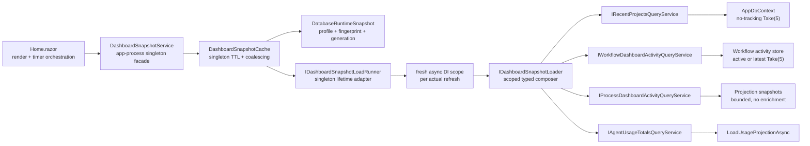

# Target Solution

## End State

## Snapshot Contract

- Immutable `DashboardSnapshot` contains load/expiry timestamps, `ImmutableArray<T>` collections with a hard maximum of five recent project rows, five workflow rows, and five process rows, plus typed activity modes and agent usage totals.
- Each activity result carries an explicit typed mode such as `Active` or `RecentFallback`; Home does not infer policy from row contents.
- `IDashboardSnapshotLoader.LoadAsync` calls only the four narrow query interfaces. It may start independent calls together, awaits all, and fails the coherent load when any source fails.
- Singleton `DashboardSnapshotService.GetAsync(refreshMode, cancellationToken)` delegates to the singleton cache. The cache calls only `IDashboardSnapshotLoadRunner` when an actual refresh is eligible and owns only immutable results, runtime identity, attempt/failure metadata, and an in-flight task; it never retains a scoped service instance, loader delegate, or caller cancellation token.
- Singleton `DashboardSnapshotLoadRunner` is the only composition/lifetime adapter: it creates a fresh async DI scope, resolves the scoped loader through that scope, awaits the coherent load with application-shutdown cancellation, and disposes the scope. `IServiceProvider` resolution is forbidden in Home, query services, loader composition, and cache policy.
- The snapshot is app-global operational data and intentionally shared across circuits. It contains no user identity, authorization decision, per-circuit UI state, or other user-specific value. Runtime profile ID, fingerprint, and generation prevent reuse across database-runtime changes.
- Concurrent normal and forced callers join the same in-flight refresh. Caller cancellation cancels only that caller's wait. A settled force call bypasses the interval; automatic calls are throttled for five minutes after both success and failure.
- Faulted/cancelled refreshes are cleared. Successful results replace cache atomically only if the runtime identity is unchanged. A failed refresh does not erase the prior success, and every later reader receives explicit stale/failure metadata rather than an unmarked old snapshot.

## UI Composition

- `PageScaffold` with compact `PageHeader`; `CompactStatStrip` shows Total tokens and Known cost (USD), plus a small refresh control/countdown.
- Lead section is a four-column `Grid` of `QuickActionCard` wrappers. Each wrapper composes shared BaseLib card/button/icon/stack primitives and owns square/centering behavior.
- Body is a large-screen two-track grid: recent projects and operational activity. `Tabs`/`TabsItem` switches Workflow runs and Process runs.
- `LoadingState`, `EmptyState`, and `Alert` are semantically separate. There are no feature overlays, dialogs, editors, or nested scrollers.

## Allowed Side Effects

- Scoped query/loader registrations plus DI-managed singleton Web service, cache, and typed load runner in existing composition extensions.
- New top-level DTO/query/service/component/test files inside already referenced projects.
- Removal of obsolete Home workbench/project-list dependencies and markup.

## Forbidden Side Effects

- No `.csproj` reference/package changes, new partial/nested service, service location outside the typed lifetime adapter, direct store/context in Home or loader, user-specific shared cache data, static mutable cache, global component/CSS asset changes, runtime mutation, schema migration beyond evidence-authorized dashboard indexes, silent source fallback, or background hosted refresh.
