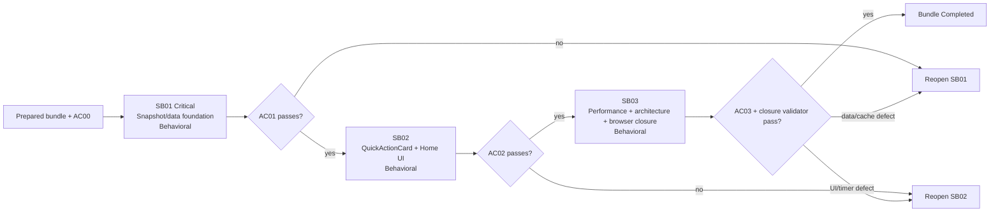

# Phase Plan

## Phase Sequence

1. Validate prepared bundle and `AC00`.
2. Execute SB01 critical data/cache foundation; record Behavioral evidence and pass `AC01`.
3. Execute SB02 QuickActionCard/Home UI; record component/browser-ready evidence and pass `AC02`.
4. Execute SB03 independent performance, architecture, build/test, and Playwright closure; pass `AC03`.
5. Run completed-stage validator and close every raw note as Solved, Partially solved, or Not solved.

## Subbundle Dependency Map

## Critical Subbundles

- SB01 is the critical foundation. SB02 and all SB03 data/performance evidence are untrustworthy if its active/fallback, cache identity, error, or coalescing proof reopens.
- SB01 proof tier: `Behavioral`.
- SB02 proof tier: `Behavioral`.
- SB03 proof tier: `Behavioral`.
- No Governed manifests/hashes are required; exact commands/results and semantic positive/negative evidence remain mandatory.

## Phase Gates

- Preparation: `validate_bundle.py --profile initiative --stage prepared` must pass.
- SB01 entry: AC00 Pass and source references still align. Closure: targeted query/cache tests, composition smoke, architecture negative proof, execution report row.
- SB02 entry: SB01 Completed/AC01 Pass. Closure: wrapper/Home component tests, timer/error semantics, exact routes, 1440x900 browser-ready DOM.
- SB03 entry: SB01/SB02 Completed. Closure: no-reference/partial/service-locator assertions, CodeAnalytics retry/manual graph, solution build, targeted suites, Playwright screenshots/analytics, raw-note closure.
- Any gate failure reopens the owning subbundle; downstream work waits or is rerun.

## Current Progression

- Preparation/AC00: `Approved`.
- SB01/AC01: `Completed / Approved` on 2026-07-22 after the final targeted foundation gate.
- SB02/AC02: `In progress`.
- SB03/AC03 and completed-stage bundle validation: `Waiting / not started`.

## Parallel-Safe Work

- Inside SB01, module-owned query implementations/tests may be assigned in parallel only with non-overlapping files; the app snapshot/cache composition waits for query contracts to settle.
- SB02 does not run in parallel with SB01 because its model/error/timing behavior depends on the foundation.
- SB03 is sequential and independent; it must not repair around a failed gate.

## UI Target Policy

- Application target: `1440x900` desktop only.
- Existing page/body owns vertical scrolling; no nested/lateral scrolling.
- No feature overlays; open-overlay proof records `N/A by explicit scope` and confirms none appears.
- First viewport target is defined in root README and SB02/SB03.
