# Phase Plan

## Current execution state

- Bundle state: `COMPLETED` on 2026-07-12.
- Active phase: `None - Phase 8 repair closed`.
- Active gate: `None - SB40 passed`.
- Gate state: `SB35-SB40 COMPLETED`.
- Final closure passed with explicit non-blocking follow-ups in `bundle://proof/SB40/manifest.md`.
- SB01-SB34 retain their historical completion records, but those records do not prove or authorize closure of the live repair.

## Phase Sequence

### Historical extraction sequence

1. **Phase 1 - Foundation contracts**: SB01-SB05 define protocol, provider registry, operations, feedback, events, source snapshots, and then harden/refactor the foundation before runtime work starts.
2. **Phase 2 - Generic runtime and drivers**: SB06-SB10 implement generic persistence/services, HTTP and MCP drivers, async workers, and a runtime checkpoint.
3. **Phase 3 - Source gateway and ingestion**: SB11-SB14 add project/workbench, process/workflow/agent, CRM/resource/manual source adapters and then harden source gateway boundaries.
4. **Phase 4 - MAF integration**: SB15-SB19 add shared operation handler, generic memory tool, workflow executor, context contributor, and then remove direct native memory links from MAF.
5. **Phase 5 - UI composition**: SB20-SB23 add common memory UI, query/operations/feedback UI, provider-specific RCL/iframe projection, and then harden UI composition.
6. **Phase 6 - Native Cognitive Memory service**: SB24-SB29 scaffold native repo/projects, extract DB/domain/engine, expose protocol API, add native MAF integration, and then harden the native service.
7. **Phase 7 - Main host decoupling and closure**: SB30-SB34 remove base host dependencies, handle data migration/retirement, rebalance tests, run E2E proof, and close with docs/final cleanup.

These phases describe the original extraction and retain audit value. Their old pass labels are historical because the 2026-07-12 live audit found architecture, routing, context, and external-service gaps.

### Current repair sequence

8. **Phase 8A - Architecture gate**: SB35 captures failing behavior, records target project/namespace ownership, selects justified patterns, defines testability contracts, and blocks production edits until review passes.
9. **Phase 8B - Generic application safety**: SB36 repairs fail-closed provider selection, operation ownership, and the overgrown generic application handlers through cohesive extracted services.
10. **Phase 8C - Agent runtime behavior**: SB37 adds typed agent invocation modes, one-to-many provider bindings and aliases, authorized `/mem:<alias>` directives, deterministic multi-provider orchestration, typed UI persistence, and an explicit runtime-integration owner.
11. **Phase 8D - Context and transport integrity**: SB38 propagates typed execution/workspace/project context, preserves transport configuration and secret references, registers MCP explicitly, aligns capability claims, and removes prohibited driver/worker/persistence partial clusters.
12. **Phase 8E - External provider hardening**: SB39 adds external Cognitive Memory authentication, caller/project authorization, access/redaction policy, strict project isolation, request limits, manifest honesty, repository independence, and checked-in raw HTTP wire conformance. Live main-driver process conformance remains a terminal SB40 check.
13. **Phase 8F - Renewed closure gate**: SB40 completed architecture, dependency, unit, integration, composition, browser/runtime, and cross-repository proof and restored bundle completion status.

Before any current repair work, implementation agents must read `inputs/05-architecture-repair-request.md` and `analysis/04-live-repo-reentry-alignment.md`. SB35 must complete before production code changes begin.

## Subbundle Dependency Map

```mermaid
flowchart TD
    SB01[SB01 Protocol envelope]
    SB02[SB02 Provider registry]
    SB03[SB03 Operation feedback events]
    SB04[SB04 Source snapshot contracts]
    SB05[SB05 Foundation checkpoint]
    SB06[SB06 Generic persistence services]
    SB07[SB07 HTTP driver]
    SB08[SB08 MCP driver]
    SB09[SB09 Async workers]
    SB10[SB10 Runtime checkpoint]
    SB11[SB11 Project sources]
    SB12[SB12 Process workflow sources]
    SB13[SB13 CRM resource manual sources]
    SB14[SB14 Source gateway checkpoint]
    SB15[SB15 Shared operation handler]
    SB16[SB16 MAF tool selection]
    SB17[SB17 Workflow executor]
    SB18[SB18 Generic context contributor]
    SB19[SB19 MAF checkpoint]
    SB20[SB20 Memory UI shell]
    SB21[SB21 Query operations feedback UI]
    SB22[SB22 Provider UI surfaces]
    SB23[SB23 UI checkpoint]
    SB24[SB24 Native repo scaffold]
    SB25[SB25 Native DB extraction]
    SB26[SB26 Native engine migration]
    SB27[SB27 Native protocol API]
    SB28[SB28 Native MAF integration]
    SB29[SB29 Native checkpoint]
    SB30[SB30 Host dependency removal]
    SB31[SB31 Data migration retirement]
    SB32[SB32 Test rebalance]
    SB33[SB33 E2E observability]
    SB34[SB34 Final cleanup]
    SB35[SB35 Architecture re-entry gate]
    SB36[SB36 Selection authorization application repair]
    SB37[SB37 Agent modes aliases directives fan-out]
    SB38[SB38 Context transport adapter repair]
    SB39[SB39 External security conformance]
    SB40[SB40 Final architecture and E2E gate]

    SB01 --> SB02
    SB01 --> SB03
    SB01 --> SB04
    SB02 --> SB05
    SB03 --> SB05
    SB04 --> SB05
    SB05 --> SB06
    SB06 --> SB07
    SB06 --> SB08
    SB06 --> SB09
    SB07 --> SB10
    SB08 --> SB10
    SB09 --> SB10
    SB10 --> SB11
    SB10 --> SB12
    SB10 --> SB13
    SB11 --> SB14
    SB12 --> SB14
    SB13 --> SB14
    SB14 --> SB15
    SB15 --> SB16
    SB15 --> SB17
    SB16 --> SB18
    SB17 --> SB18
    SB18 --> SB19
    SB19 --> SB20
    SB20 --> SB21
    SB20 --> SB22
    SB21 --> SB23
    SB22 --> SB23
    SB23 --> SB24
    SB24 --> SB25
    SB25 --> SB26
    SB26 --> SB27
    SB27 --> SB28
    SB28 --> SB29
    SB29 --> SB30
    SB30 --> SB31
    SB31 --> SB32
    SB32 --> SB33
    SB33 --> SB34
    SB34 -. historical closure reopened .-> SB35
    SB35 --> SB36
    SB36 --> SB37
    SB37 --> SB38
    SB38 --> SB39
    SB39 --> SB40
```

## Critical Subbundles

- SB01 is a critical foundation because all later providers, drivers, operations, source snapshots, MAF tools, and UI surfaces depend on the protocol envelope shape.
- SB02 is critical because provider identity, capability manifests, and selection rules drive every multi-provider scenario.
- SB03 is critical because long-running operation, event, and feedback ledgers cannot be retrofitted safely after tools/workflows start using memory.
- SB04 is critical because Source Gateway contracts prevent host AppDbContext leakage and define ingestion safety.
- SB04 is also critical because it must reuse, rehome, or explicitly migrate the current MAF `MemorySourceSnapshot*` contracts instead of creating a parallel source snapshot model.
- SB05 is a checkpoint-critical foundation gate before any runtime implementation.
- SB06 is critical because it turns the contracts into the generic runtime/persistence model.
- SB09 is critical because async operation workers, inbox/outbox, timeout, and cancellation behavior protect networked providers.
- SB10 is a checkpoint-critical runtime gate before source adapters and MAF integration.
- SB14 is a checkpoint-critical source gateway gate before MAF can request or send source snapshots.
- SB15 is critical because it prevents duplicate tool/executor operation paths.
- SB15 is also critical because it defines the shared handler used by tools, workflow executors, context contributors, UI, and APIs.
- SB18 is critical because it removes direct native memory context contribution from MAF.
- SB18 must integrate through the current `IAgentContextContributor` and `MafAgentContextContributionProvider` path.
- SB19 is a checkpoint-critical MAF decoupling gate before UI and native extraction.
- SB23 is a checkpoint-critical UI gate before native provider UI extraction.
- SB25 is critical because native DB ownership is the main separation boundary.
- SB27 is critical because the native provider must speak the generic protocol before old direct host dependencies are removed.
- SB29 is a checkpoint-critical native service gate before main host dependency removal.
- SB30 is critical because the main host must stop requiring native Cognitive Memory and Qdrant.
- SB33 is closure-critical because it proves the full startup, multi-provider, native provider, source, event, feedback, and UI behavior.
- SB34 is the final release gate and must not close while any prior checkpoint has unresolved exceptions.
- SB35 is the current architecture stop gate. It must prove the repair has cohesive ownership, legal dependency direction, justified patterns, isolated tests, and explicit characterization before production edits.
- SB36 is safety-critical because implicit registry-first fallback and operation access by GUID can cross agent/provider boundaries.
- SB37 is behavior-critical because typed settings, invocation mode, aliases, directive sanitization, and one-agent/many-provider orchestration are the user's primary runtime requirements.
- SB38 is integration-critical because missing execution/project identity and destructive transport-profile editing make otherwise correct provider calls unreliable or insecure.
- SB39 is security-critical because a working in-process engine does not prove authenticated, authorized, project-isolated external memory.
- SB40 supersedes SB34 as the current final closure gate. It must independently verify the repaired architecture and behavior rather than reuse historical proof labels.

## Phase Gates

- Gate before SB06: SB01-SB05 must prove contract completeness, provider selection shape, operation/feedback/event lifecycle, source snapshot safety, no native-specific leakage into generic contracts, zero-provider typed behavior, and bounded helper structure.
- Gate before SB11: SB06-SB10 must prove generic runtime persistence, driver selection, timeout/cancellation, async status, worker behavior, zero-provider service registration, and no Qdrant/native dependency in generic runtime.
- Gate before SB15: SB11-SB14 must prove source adapters provide snapshots with provenance, sensitivity, redaction, no duplicate source snapshot contract family, and no provider direct AppDbContext access.
- Gate before SB20: SB15-SB19 must prove MAF tools, workflow executors, and context contributors use generic memory only, integrate through current MAF seams, share a single operation handler, and handle no-provider state predictably.
- Gate before SB24: SB20-SB23 must prove generic UI works with zero/mock providers and provider-specific surfaces are optional.
- Gate before SB30: SB24-SB29 must prove native service DB/API/engine/MAF integration works through the protocol and does not depend on the main app module.
- Gate before SB34: SB30-SB33 must prove base startup without Qdrant/native memory, data migration/retirement safety, test rebalance, E2E behavior, observability, and docs.
- Gate before SB36: SB35 must pass the C# architecture review with current inventory, target boundaries, dependency rules, justified pattern records, testability contracts, baseline failures, and no production edits made ahead of the gate.
- Gate before SB37: SB36 must prove provider selection is explicit/fail-closed, agent/provider allowlists are enforced, operation status/cancel are ownership-authorized, and application responsibilities are cohesive top-level services.
- Gate before SB38: SB37 must prove typed settings/UI persistence, all three invocation modes, authorized/sanitized directives, deterministic one-agent/many-provider behavior, and compatibility behavior for existing agents.
- Gate before SB39: SB38 must prove typed context survives the real runtime and HTTP/MCP envelope path, profile editing is lossless and secret-safe, production driver registration is explicit, and capability manifests are honest.
- Gate before SB40: SB39 must prove external authentication, authorization, access/redaction policy, strict project isolation, request constraints, truthful manifest behavior, zero sibling project references, isolated build/test, and a process-ready wire fixture seam. SB40 must run the real main driver against that process before closure.
- Gate for renewed completion: passed. SB40 evidence is indexed by `bundle://proof/SB40/manifest.md`; the completed-stage validator returned exit code 0.

## Checkpoint Exit Criteria

| Checkpoint | Must prove | Blocks |
| --- | --- | --- |
| SB05 | Contracts are generic, typed, versioned, tested, free of native `CognitiveMemory*` leakage except documented migration adapter tests, and aligned with current MAF source snapshot contracts. | SB06 |
| SB10 | Generic runtime has bounded public APIs, no duplicate driver helpers, resilient async behavior, zero-provider registration proof, and architecture guards against Qdrant/native dependencies. | SB11 |
| SB14 | Source Gateway adapters never expose EF entities, have provenance/sensitivity metadata, reuse or migrate current source snapshot contracts, and fail closed under missing permissions. | SB15 |
| SB19 | MAF uses generic memory tool/executor/contributor only, with provider selection, current MAF integration proof, no direct native dependency, and no silent provider fallback. | SB20 |
| SB23 | Generic UI works independently from native UI; provider-specific surfaces are optional and fallback-safe. | SB24 |
| SB29 | Native service owns DB and engine, implements protocol, supports MAF abstractions where needed, and is ready for main host decoupling. | SB30 |
| SB34 | All direct dependencies, migrations, tests, docs, and release notes are closed or explicitly deferred with owner and risk. | Release/merge |
| SB35 | Current architecture artifacts and characterization proof are complete; dependency direction and extraction targets are explicit; the architecture review passes before production edits. | SB36 |
| SB40 | R19/R20 and R22-R29 are proven with current artifacts; no prohibited partial clusters, implicit fallback, context loss, cross-owner operation access, secret leakage, external isolation defect, or unresolved architecture exception remains. | Renewed release/merge |
