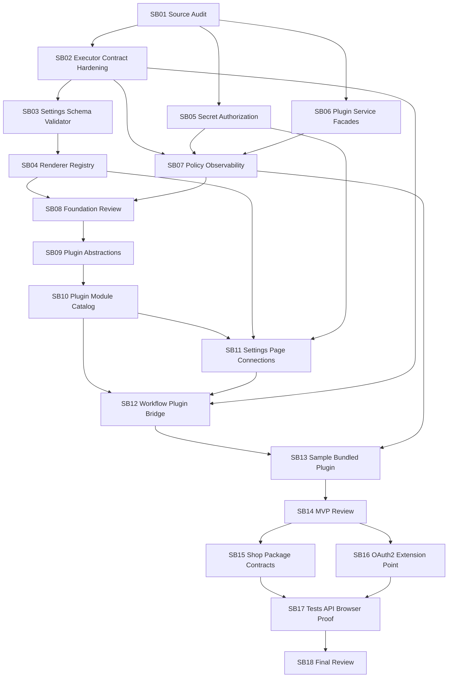

# Phase Plan

## Phase A: Foundation Before Plugin Module

Subbundles:

- `SB01` source audit
- `SB02` workflow executor descriptor hardening
- `SB03` settings schema canonicalization
- `SB04` renderer registry/schema fallback
- `SB05` secret authorization and plugin secret broker
- `SB06` service facades
- `SB07` policy/observability/sanitization
- `SB08` architecture review gate

Goal: make the existing system plugin-ready without adding a plugin module.

## Phase B: Bundled Plugin MVP

Subbundles:

- `SB09` plugin abstractions
- `SB10` plugin module catalog/persistence
- `SB11` plugin settings page and connection model
- `SB12` workflow plugin executor bridge
- `SB13` sample bundled plugin
- `SB14` architecture review gate

Goal: support bundled/static plugins as workflow executors.

## Phase C: Shop/OAuth/Proof Closure

Subbundles:

- `SB15` shop/package contracts
- `SB16` OAuth2 extension point
- `SB17` tests/API/browser proof
- `SB18` final architecture review and closure

Goal: define future shop/OAuth seams and prove the MVP does not regress core workflows/settings/secrets.

## Dependency Map

## Execution Table

| Id | Folder | Phase | Status | Dependencies | Objective |
| --- | --- | --- | --- | --- | --- |
| SB01 | 01-01-plugin-readiness-source-audit-and-decision-gate | Prerequisite | Ready | None | Audit current code, confirm assumptions, update source map/risk register before edits. |
| SB02 | 02-02-workflow-executor-contract-hardening | Prerequisite | Ready | SB01 | Harden executor descriptor/provenance/availability/policy/schema metadata for plugin ownership. |
| SB03 | 03-03-settings-schema-canonicalization-and-validator | Prerequisite | Ready | SB02 | Extract/adapt canonical settings schema/state/validator from connector infrastructure. |
| SB04 | 04-04-settings-renderer-registry-and-schema-fallback | Prerequisite | Ready | SB03 | Create renderer registry and schema fallback UI; begin de-hardcoding workflow settings UI. |
| SB05 | 05-05-secret-runtime-authorization-and-plugin-secret-broker | Prerequisite | Ready | SB01,SB03 | Make secrets consumer-bound and introduce plugin-facing secret broker contract. |
| SB06 | 06-06-workspace-file-storage-project-facades | Prerequisite | Ready | SB01 | Create plugin-safe workspace/storage/project-structure facades and fix concrete Workbench leakage. |
| SB07 | 07-07-policy-observability-and-sanitization | Prerequisite | Ready | SB02,SB05,SB06 | Add execution policy/audit/sanitization foundations for plugin executor calls. |
| SB08 | 08-08-architecture-review-gate-foundations | Review Gate | Ready | SB01-SB07 | Mandatory foundation review before plugin module starts. |
| SB09 | 09-09-plugins-abstractions-project-and-manifest | MVP | Ready | SB08 | Create plugin abstractions project and manifest/capability contracts. |
| SB10 | 10-10-plugins-module-catalog-and-persistence | MVP | Ready | SB09 | Create Plugins module, catalog, installed state, API wiring, composition, migrations. |
| SB11 | 11-11-plugin-settings-page-and-connection-model | MVP | Ready | SB10,SB04,SB05 | Add plugin catalog/settings UI, connection settings, health check surface. |
| SB12 | 12-12-workflow-plugin-executor-bridge | MVP | Ready | SB10,SB11,SB02 | Bridge plugin executors into workflow catalog/canvas/invoker with connection selection. |
| SB13 | 13-13-sample-bundled-plugin | MVP | Ready | SB12,SB07 | Add a small bundled external-service plugin proving settings, secrets, executor, and workflow usage. |
| SB14 | 14-14-architecture-review-gate-plugin-mvp | Review Gate | Ready | SB09-SB13 | Mandatory MVP architecture review before shop/OAuth expansion. |
| SB15 | 15-15-plugin-shop-and-package-contracts | Future-facing | Ready | SB14 | Define remote shop/catalog/package/install contract and trust metadata. |
| SB16 | 16-16-oauth2-extension-point-and-connection-broker | Future-facing | Ready | SB14 | Add OAuth2 broker contracts/storage placeholders/provider extension points. |
| SB17 | 17-17-tests-api-and-browser-proof | Closure | Ready | SB15,SB16 | Complete unit/integration/component/browser proof and regression matrix. |
| SB18 | 18-18-final-architecture-review-and-closure | Review Gate | Ready | SB17 | Final review, docs, execution report, and handoff. |
