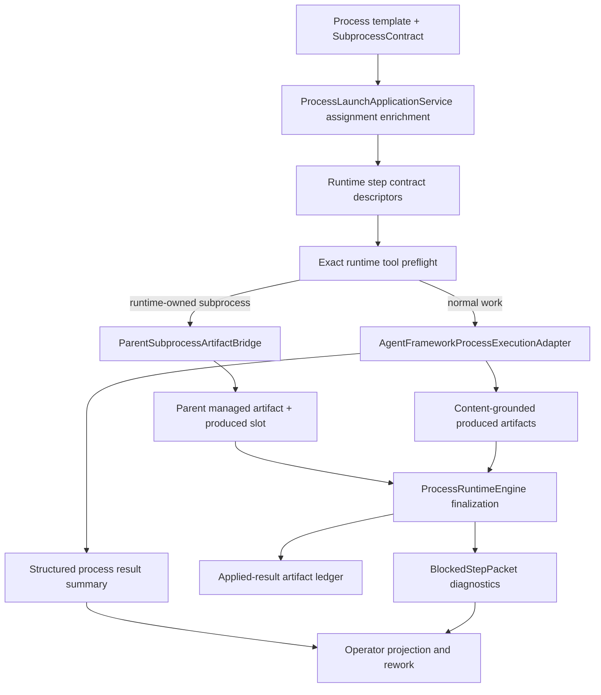

# Target Solution

## Target Architecture

The target is a typed hardening layer around the existing process runtime and MAF integration, not a rewrite.

## Desired End State

- Operator actions and rework packets are exact enough to distinguish missing output, missing child handoff, no-go child result, active child wait, missing composed tool, denied tool, missing AgentFramework observation, and finalization downgrade.
- `StepKind=Subprocess` is runtime-owned by default when a typed `SubprocessContract` is present.
- Parent produced artifacts are synthesized from accepted child artifacts, not from arbitrary child folders.
- Artifacts in prompts, receipts, ledgers, and diagnostics carry semantic descriptors and content-grounded refs.
- Runtime tool requirements are preflighted against the composed provider/tool set for the actual governed process context before LLM execution.
- Process templates use typed metadata for hard gates and keep markdown as explanatory guidance.
- Tests reproduce the failure class without live LLM or external network dependency.

## Boundary Rules

- Contracts and DTOs: `CanDoItAll.Processes.Contracts`, `CanDoItAll.Processes.Abstractions`, and `CanDoItAll.Processes.Drivers.Abstractions` may hold stable records/interfaces such as descriptors, selectors, bridge requests, preflight results, and diagnostics when they are consumed across layers.
- Runtime: `CanDoItAll.Processes.Runtime` may own state-machine finalization, produced-slot application, applied-result ledger decisions, and domain-neutral lifecycle transitions.
- Application: `CanDoItAll.Processes.Application` may own launch enrichment, operator/rework packet composition, and process-use-case coordination.
- Templates: `CanDoItAll.Processes.Templates` may own template document shape, compatibility loading, validation, and summary projection.
- Module integration: `CanDoItAll.Modules.Processes` and `CanDoItAll.Modules.Workbench` may own AgentFramework adapter behavior, managed artifact I/O, project-structure tool composition, and infrastructure-facing subprocess launch.
- MAF core/models: may own AgentFramework execution result persistence and runtime tool capability catalogs, but not process-template-specific branch semantics.

## Explicit Anti-Goals

- Do not move .NET delivery behavior into generic runtime.
- Do not implement bridge logic by adding another large `AgentFrameworkProcessExecutionAdapter.*.cs` partial as the final boundary.
- Do not store typed template contracts as unvalidated `JsonElement` dictionaries through runtime behavior.
- Do not use broad fallback that silently treats child folder existence as accepted handoff.
- Do not make a service locator or `IServiceProvider` path the core runtime behavior.
- Do not make tests depend on live providers or full app host construction for unit-level behavior.
