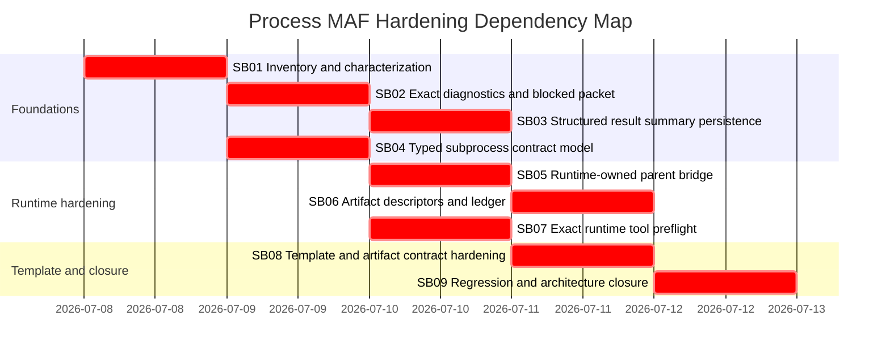

# Phase Plan

## Phase Sequence

1. SB01 inventories current source, tests, templates, and the blocked scenario class.
2. SB02 fixes exact observation correlation and introduces blocked step packets.
3. SB03 persists structured process result summaries for process-bound AgentFramework runs.
4. SB04 adds typed subprocess contract model, loader support, and validation.
5. SB05 implements runtime-owned parent subprocess bridge.
6. SB06 adds semantic artifact descriptors, content-grounded materialization, and applied-result ledger.
7. SB07 adds exact composed runtime tool preflight.
8. SB08 hardens all affected process and artifact templates.
9. SB09 adds the full regression harness, recovery playbook, and final architecture closure.

## Subbundle Dependency Map

## Critical Subbundles

All subbundles are critical because this is a process-control and proof-chain repair. Weak proof in any phase can let downstream process runs silently repeat the same loop.

| Subbundle | Critical reason | Downstream phases blocked until pass |
| --- | --- | --- |
| SB01 | Establishes true scope across all templates and source owners. | All. |
| SB02 | Makes blockers diagnosable and prevents blind retry. | SB03, SB07, SB09. |
| SB03 | Makes AgentFramework process results parseable and durable. | SB06, SB09. |
| SB04 | Defines typed contract language for subprocess bridge and template hardening. | SB05, SB08. |
| SB05 | Fixes runtime-owned subprocess completion and no-go propagation. | SB08, SB09. |
| SB06 | Fixes artifact truth and ledger consistency. | SB08, SB09. |
| SB07 | Stops missing tool loops before LLM execution. | SB08, SB09. |
| SB08 | Applies typed hardening across all affected templates/artifacts. | SB09. |
| SB09 | Proves fake-proof resistance and closes architecture. | Final closure. |

## Phase Gates

### Prepared Gate

- Run `validate_bundle.py --stage prepared`.
- Confirm CodeAnalytics snapshot id and dependency-cycle result are recorded.
- Confirm every GPTPro finding F01-F12 maps to requirements and subbundles.
- Confirm all nine subprocess parent steps are enumerated.

### Entry Gate For Every Subbundle

- Reopen this bundle root, the subbundle README, `plan/01-phase-plan.md`, `traceability/01-requirement-traceability.md`, and relevant architecture files.
- Confirm prerequisites and upstream proof are complete.
- If source changed since preparation, refresh exact source references before editing.
- If CodeAnalytics is available and the phase touches architecture-heavy code, build a narrowed snapshot before implementation.

### Closure Gate For Every Critical Subbundle

- Update `reviews/01-execution-report.md`.
- Populate `proof/SBxx/manifest.md` and `proof/SBxx/semantic-invariants.md`.
- Include failing-first and passing transcript paths for behavior changes.
- Include source assertions, changed-file hashes, anti-stub audit, and production behavior artifact matrix when new records/signals/events/states are introduced.
- Run relevant tests and build checks.
- Run C# architecture review gate before dependent phases proceed.

### Reopen Gate

Reopen earlier work if:

- a template outside the nine-parent inventory contains equivalent subprocess/handoff behavior;
- bridge proof accepts child folder existence without accepted artifact;
- preflight fails after agent execution already started;
- operator action still recommends blind retry;
- content-grounded artifact hash or ledger proof is absent;
- template validation passes while prose still contains untyped hard gates.

### Final Closure Gate

- Run `validate_bundle.py --stage completed` after implementation.
- Refresh CodeAnalytics snapshot and dependency/cycle evidence.
- Run full targeted test suite and any broader solution build/test required by changed projects.
- Add current blocked-run recovery/playbook evidence or explicit environment blocker.
- Complete note-by-note GPTPro finding closure as `Solved`, `Partially solved`, or `Not solved`.
