# Phase Plan

## Phase Sequence

1. Prepare and validate the feedback bundle against the current repo and the reported stack trace.
2. Execute subbundle 01 as the critical foundation for split-file popover access and scene-hover state invariants.
3. Execute subbundle 02 only after subbundle 01 proves that canvas annotation hover no longer throws and no stale state suppresses follow-on behavior.
4. Execute subbundle 03 for builds, browser proof, raw-note closure, and final gate review.
5. Reopen the bundle only after the original closure work if the requested follow-up widens scope into JS organization, and lock the new hotspot boundaries before editing code.
6. Execute subbundle 05 as the first implementation phase for the `06` canvas-renderer split so scene-hit helpers and drawing responsibilities are separated before the larger runtime-entry refactor.
7. Execute subbundle 06 only after subbundle 05 proves the staged asset load still works, then finish the `07` runtime split, targeted helper consolidation, build, browser proof, and completed-stage revalidation.
8. Reopen the bundle for subbundle 07 when a real app route exposes a null-host workbench interop failure that was not covered by the earlier workbench proof.
9. Execute subbundle 08 only after subbundle 07 proves the Processes Run-tab lifecycle is stable, then close the reopened scope with a real app route matrix and blocker logging.
10. End with completed-stage bundle validation and reopen any earlier phase if browser proof contradicts the organization-boundary assumptions.

## Subbundle Dependency Map

```mermaid
flowchart TD
    Prep["Prepared bundle and readiness gate"] --> SB01["01 Hover and popover state invariants"]
    SB01 --> Gate01{"Crash removed and canvas hover state trusted?"}
    Gate01 -->|Yes| SB02["02 Canvas runtime hardening across node interactions"]
    Gate01 -->|No| SB01
    SB02 --> Gate02{"Shared-canvas behavior still preserved across clicks and rerenders?"}
    Gate02 -->|Yes| SB03["03 Browser proof and closure"]
    Gate02 -->|No| SB02
    SB03 --> Reopen["04 JS hotspot inventory and boundaries"]
    Reopen --> Gate04{"Safe execution seams locked?"}
    Gate04 -->|Yes| SB05["05 Canvas renderer scene split"]
    Gate04 -->|No| Reopen
    SB05 --> Gate05{"Asset order and workbench smoke still trusted?"}
    Gate05 -->|Yes| SB06["06 Runtime entry splitting and regression proof"]
    Gate05 -->|No| SB05
    SB06 --> Reopen2["07 Workbench interop lifecycle hardening"]
    Reopen2 --> Gate07{"Processes Run tab stable without host-null circuit failure?"}
    Gate07 -->|Yes| SB08["08 Cross-canvas app proof and blockers"]
    Gate07 -->|No| Reopen2
    SB08 --> Close["Completed-stage validator and extension closure"]
```

## Critical Subbundles

- `01-hover-and-popover-state-invariants` is the critical UI foundation. If it is wrong, later browser proof is untrustworthy because the shared popover entry path and annotation hover state can still fail under the same trigger.
- `02-canvas-runtime-hardening-across-node-interactions` is the dependent runtime sweep. It must confirm that the foundation fix did not leave stale-state regressions in click, refresh, or rerender flows before closure work begins.
- `03-browser-proof-and-closure` is not allowed to downgrade weak UI proof into prose. If sandbox and workbench results diverge, earlier subbundles reopen.
- `04-js-hotspot-inventory-and-boundaries` is the organization control point. If it widens into unverified files, the refactor loses trust and must stop.
- `05-canvas-renderer-scene-split` is the first structural phase. It must keep asset order and shared exports intact before `07-runtime-entry.js` is touched.
- `06-runtime-entry-splitting-and-regression-proof` is the closure phase for the organization extension. It must finish the split, consolidate proven duplication, and re-prove the real workbench route before the bundle can close again.
- `07-workbench-interop-lifecycle-hardening` is the reopened critical foundation for the real app failure. If it is wrong, Processes Run-tab selection sync can still break the circuit during routine tab changes.
- `08-cross-canvas-app-proof-and-blockers` is the final app-surface closure gate. It must distinguish real canvas proof from unrelated route blockers.

## Phase Gates

- After preparation: run `validate_bundle.py --stage prepared` and fix every failure before touching runtime code.
- Before subbundle 01: confirm the current repo still matches the identified split-file defect and stale-state findings.
- After subbundle 01: require targeted validation plus browser proof that annotation hover no longer throws and the popover can still open.
- Before subbundle 02: confirm subbundle 01 is complete and trusted, then audit nearby click and refresh paths before editing.
- After subbundle 02: require browser proof for hover, click, refresh, and open-popover visibility on the shared canvas route.
- Before subbundle 04: inventory the larger CanvasLib JS surface and record why the executed seams stay in workbench runtime instead of widening into calendar files.
- After subbundle 04: rerun `validate_bundle.py --stage prepared` against the extended bundle before editing JS.
- After subbundle 05: require a workbench load smoke that confirms the split asset chain still initializes and the canvas hover path still responds.
- After subbundle 07: require Processes `Steps -> Runs -> Definition -> Runs` proof with no JS errors or circuit failure.
- Before final closure: run the real build, re-check the reachable app canvas routes, update the execution report with any blocked route, review screenshots, and rerun the bundle validator at completed stage.
