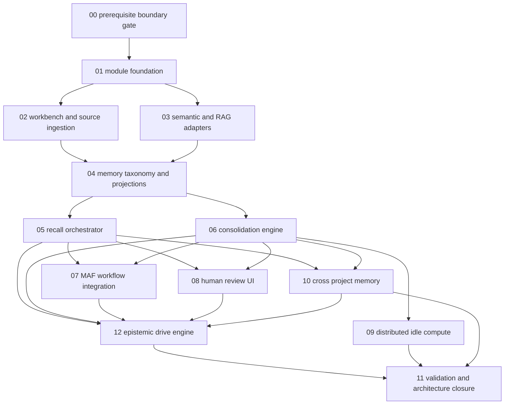

# Phase Plan

## Execution Order

1. `00-prerequisite-boundary-gate`
2. `01-module-foundation`
3. `02-workbench-and-source-ingestion`
4. `03-semantic-and-rag-adapters`
5. `04-memory-taxonomy-and-projections`
6. `05-recall-orchestrator`
7. `06-consolidation-engine`
8. `07-maf-workflow-integration`
9. `08-human-review-ui`
10. `09-distributed-idle-compute`
11. `10-cross-project-memory`
12. `11-epistemic-drive-engine` in `plan/subbundles`, mirrored as `subbundles/12-epistemic-drive-engine`
13. `11-validation-and-architecture-closure`

Root subbundle `11-validation-and-architecture-closure` already existed before Epistemic Drive was added, so the mirrored root execution subbundle uses `12-epistemic-drive-engine`. Run Epistemic Drive before validation closure even though the existing validation folder keeps its original number.

## Subbundle Dependency Map

## Critical Subbundles

- `00-prerequisite-boundary-gate` is mandatory before implementation because the current MAF context path is private and source ingestion lacks stable snapshot contracts.
- `01-module-foundation` defines durable state, migrations, registration, policy surfaces, and test seams.
- `04-memory-taxonomy-and-projections` must land before recall because Qdrant/search are rebuildable projections, not source truth.
- `05-recall-orchestrator` must record traces and budget exclusions before MAF integration uses the output.
- `06-consolidation-engine` must prove idempotency, versioning, and review handoff before distributed compute is allowed.
- `12-epistemic-drive-engine` must run before validation closure because it adds metacognitive gap detection, learning proposals, and approval-gated learning workflows on top of recall, consolidation, MAF, and review.

## Phase Gates

| Gate | Required proof |
|---|---|
| Prerequisite gate | MAF context contributor boundary and source snapshot contracts are approved or implemented by their own bundle. |
| Foundation gate | EF model registration, storage references, source hashes, algorithm versions, and policies exist in the design and tests. |
| Workbench gate | Workbench source snapshots produce deterministic source item ids, hashes, links, layout metadata, and provenance. |
| Projection gate | Projection state can be rebuilt from durable memory and can survive Qdrant unavailability. |
| Recall gate | Recall traces explain included, excluded, unavailable, and budget-limited memory channels. |
| Consolidation gate | Consolidation is resumable, idempotent, review-aware, and never promotes high-risk generated memory silently. |
| MAF gate | MAF consumes context packs through extension contracts and does not own durable memory policy. |
| UI gate | Operator pages show source evidence, trace reasons, review decisions, and projection/consolidation health. |
| Distributed gate | Worker outputs are accepted only through leases, hashes, versions, and authoritative coordinator validation. |
| Epistemic Drive gate | Knowledge need vectors preserve dimensions, proposal evidence is inspectable, external study is approval-gated, and scalar-only prioritization is rejected. |
| Closure gate | Golden datasets, failure cases, browser evidence, and architecture review are complete. |

## Implementation Policy

- Do not implement Cognitive Memory before `00-prerequisite-boundary-gate` is closed.
- Do not let generated summaries become raw source truth.
- Do not write memory directly from distributed workers.
- Do not add stringly typed mode flags; use enums/options and persisted mode/version state.
- Do not collapse Epistemic Drive into a simple scalar priority score.
- Do not run learning tasks against external sources or promote high-impact learning outputs without required approval.
