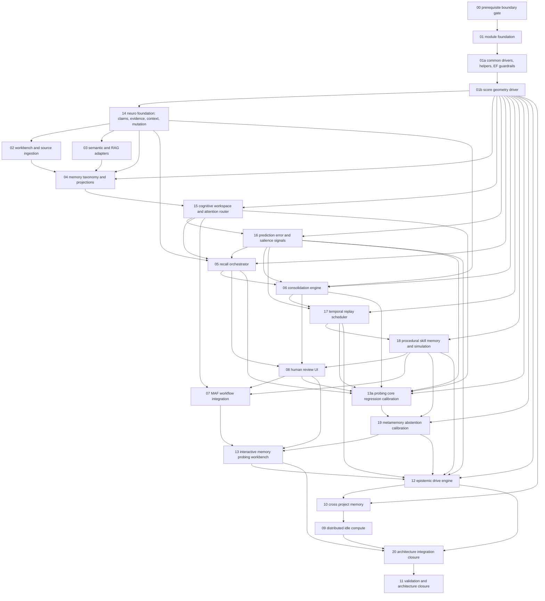

# Phase Plan

## Execution Order

Dependency order is authoritative. Folder numbers for `12`, `13`, and `14-20` are historical patch identifiers, not permission to execute them late.

1. `00-prerequisite-boundary-gate`
2. `01-module-foundation`
3. `01a-common-drivers-helpers-and-ef-guardrails`
4. `01b-score-geometry-driver`
5. `14-neuro-foundation-claim-evidence-ledger`
6. `02-workbench-and-source-ingestion`
7. `03-semantic-and-rag-adapters`
8. `04-memory-taxonomy-and-projections`
9. `15-cognitive-workspace-attention-router`
10. `16-prediction-error-salience-signals`
11. `05-recall-orchestrator`
12. `06-consolidation-engine`
13. `17-temporal-replay-scheduler`
14. `18-procedural-skill-memory-simulation`
15. `08-human-review-ui`
16. `07-maf-workflow-integration`
17. `13a-probing-core-regression-calibration`
18. `19-metamemory-abstention-calibration`
19. `13-interactive-memory-probing-workbench`
20. `12-epistemic-drive-engine`
21. `10-cross-project-memory`
22. `09-distributed-idle-compute`
23. `20-architecture-integration-closure`
24. `11-validation-and-architecture-closure`

## Execution Control Ledger

The implementation-control workbook is a required durable state artifact:

- `C:\repositories\CanDoItAll\codex\bundles\cognitive-memory-architecture-v2\checklists\cognitive-memory-implementation-control.xlsx`

The workbook owns structured status, checklist, proof, risk, and handoff tracking. `reviews/01-execution-report.md` remains the narrative execution report. Both must agree before a phase can close.

Required workflow for every subbundle:

1. Before implementation starts, set the phase row in `Phase Gates` to `In Progress`, confirm prerequisite rows are `Passed`, and record the branch/commit being used.
2. During implementation, update owned rows in `Phase Acceptance Checklist` and add proof paths in `Validation Evidence` as soon as they exist.
3. Before closure, set every owned checklist row to `Passed`, `Deferred`, or `Blocked`; add a `Handoff Log` row; update `reviews/01-execution-report.md`; then set the phase row to `Passed` only if the progression gate is satisfied.
4. If downstream work exposes a weak upstream assumption, mark the current phase `Blocked`, reopen the upstream phase, and stop. Do not compensate in later phases.

Status values are fixed: `Not Started`, `Ready`, `In Progress`, `Blocked`, `Passed`, `Deferred`, `Reopened`.

The root `subbundles/` directory is authoritative. `plan/subbundles/` is a synchronized mirror and must remain byte-equivalent when subbundle plans change.

Rationale:

- Common drivers, helpers, fake providers, serialization policy, EF query policy, and performance guardrails must exist before source ingestion, adapters, taxonomy, recall, or probing start.
- Score geometry must exist immediately after common helpers. Recall, attention, belief, salience, replay, probing, answer gating, Epistemic Drive, and cross-project promotion must not invent local scalar scoring.
- Claim/evidence/belief, evidence anchors, entity/context binding, and mutation authority are foundations. If they are added after source ingestion or recall, downstream records will have the wrong shape.
- Workspace and attention must exist before recall/probing/MAF flows claim to be cognitive. A context pack is rendered output, not active working memory.
- Prediction error and salience signals must exist before recall, consolidation, probing, replay, and Epistemic Drive depend on activation and learning evidence.
- Replay and procedural skill memory should be built after consolidation basics but before MAF, probing, learning, cross-project, or distributed execution can promote procedural behavior.
- Metamemory answer gating depends on recall, workspace, claims, signals, calibration, procedure maturity, and access policy. It must close before the Dialogue Workbench and MAF answer injection are treated as complete.
- Epistemic Drive runs after project-scoped recall, consolidation, review, probing evidence, answer-gate evidence, and salience/replay signals are stable.
- Cross-project memory and distributed compute remain scale/promotion extensions after project-scoped safety is proven.

## Subbundle Dependency Map

## Critical Subbundles

- `00-prerequisite-boundary-gate` validates the target branch boundary contracts. If the MAF context contribution or source snapshot contracts regress, implementation stops.
- `01-module-foundation` owns the durable state boundary, module registration, policy surfaces, and identity model.
- `01a-common-drivers-helpers-and-ef-guardrails` prevents later phases from creating local string state, unbounded list contracts, ad hoc JSON payloads, inconsistent fake providers, or expensive EF query patterns.
- `01b-score-geometry-driver` is a critical foundation. It prevents later phases from regressing to scalar add/subtract scoring and provides reusable score spaces, vectors, shapes, scalar projections, and evaluation traces.
- `14-neuro-foundation-claim-evidence-ledger` is a critical foundation. It defines evidence anchors, atomic claims, entity/context binding, and mutation authority before any downstream durable memory is shaped.
- `02-workbench-and-source-ingestion` proves deterministic source identity, cursor behavior, redaction, and layout/graph metadata before canonical memory exists.
- `04-memory-taxonomy-and-projections` proves durable source truth, relation semantics, claim/context projection payloads, projection state, and rebuildability before recall.
- `15-cognitive-workspace-attention-router` proves working memory and executive routing are explicit before recall/probing/MAF flows use context.
- `16-prediction-error-salience-signals` proves cognitive signal vectors and prediction errors are durable, dimensional, and auditable before activation, replay, probing, or Epistemic Drive consume them.
- `05-recall-orchestrator` proves staged, bounded, workspace-aware, claim-aware, traceable recall and Docker context separation before MAF, probing, learning, or answer gates use memory answers.
- `06-consolidation-engine` proves idempotent, mutation-authority-based, review-aware durable mutation before replay, distributed compute, or Epistemic Drive.
- `17-temporal-replay-scheduler` proves episodic order, causal links, and replay safety before procedure skill reinforcement or distributed replay.
- `18-procedural-skill-memory-simulation` proves procedures are skill graphs with maturity and simulation is speculative before workflow automation or MAF procedure guidance.
- `13a-probing-core-regression-calibration` proves corrections are evidence, regression tests replay, and calibration records exist before UI and learning consume probing results.
- `19-metamemory-abstention-calibration` proves answer-time warnings, clarification, source audit, probing, review, learning request, and abstention before answer rendering is treated as safe.
- `12-epistemic-drive-engine` proves vector-based knowledge need, approval-gated learning, signal/error/replay evidence consumption, and source-grounded proposals before cross-project and distributed extensions.

## Phase Gates

| Gate | Required proof |
|---|---|
| Prerequisite gate | MAF context contributor boundary and source snapshot contracts are present, tested, and approved for consumption. |
| Foundation gate | EF model registration, storage references, source hashes, algorithm versions, policy surfaces, and typed identities exist in the design and tests. |
| Common guardrail gate | Shared fake providers, paging/budget helpers, source-generated JSON plan, strongly typed state/profile/evidence contracts, and EF query/index rules are available to downstream subbundles. |
| Score geometry gate | Score spaces, vector snapshots, shape definitions, missing-dimension policy, scalar projection policy, evaluation traces, deterministic fake driver, and scalar-only rejection tests are available to downstream subbundles. |
| Neuro foundation gate | Evidence anchors, atomic claims, support/attack links, context frames, entity aliases, mutation commands, audit records, and projection invalidation rules are modeled relationally and cannot be bypassed by public writes. |
| Source ingestion gate | Workbench/process/workflow source snapshots produce deterministic source item ids, hashes, cursors, links, layout metadata, provenance, evidence anchors, context hints, and redaction decisions. |
| Adapter gate | Semantic and RAG adapters use typed filters, typed projection payloads, payload indexes, delete-by-filter, provider availability traces, and deterministic fake providers. |
| Taxonomy/projection gate | Canonical memory, claims, source refs, evidence anchors, relations, activation state, projection records, and rebuild rules are durable and do not depend on Qdrant as truth. |
| Workspace/attention gate | Workspace frames, focus slots, open questions, inhibited candidates, attention decisions, and context budgets are persisted/auditable where required and expire safely by default. |
| Signal gate | Prediction expectations/errors and cognitive signals preserve score dimensions, evidence, actor, timestamp, algorithm/profile version, and cannot create truth or bypass policy. |
| Recall gate | Recall traces explain workspace, attention, score vector/shape evaluation, selected claims, evidence anchors, included/excluded/unavailable/redacted/stale/contradicted/budget-limited channels; Docker context separation passes. |
| Consolidation gate | Consolidation is resumable, idempotent, mutation-authority based, review-aware, versioned, and never promotes high-risk generated memory silently. |
| Replay gate | Episodes preserve order/causality; replay jobs are prioritized by score-geometry traces over signals/errors/risk/staleness/usefulness; replay output creates drafts/review/projection invalidations only. |
| Procedural skill gate | Skills have preconditions, steps, postconditions, failure modes, validation evidence, maturity, risk, and automation policy; simulation output remains speculative. |
| Review/UI gate | Operator pages show source evidence, claim evidence, trace reasons, review decisions, projection/consolidation/procedure health, and browser evidence for dense views. |
| MAF gate | MAF consumes workspace-aware context packs through extension contracts and does not own workspace, mutation authority, durable memory policy, or projection writes. |
| Probing core gate | Probe answers persist recall traces, workspace frame ids, selected claims, prediction errors/signals where relevant; feedback cannot mutate active truth; correction/review/regression/evidence/calibration flows pass without UI. |
| Answer gate | Metamemory gate uses answer-gate score geometry over source sufficiency, context fit, belief state, calibration, contradiction risk, staleness, redaction, risk, and policy to answer, warn, clarify, audit, probe, review, request learning, or abstain. |
| Probing workbench gate | Browser proof shows dialogue, workspace/focus, trace/source/claim panels, correction, feedback, answer-gate warning, and regression flows without overlap, hidden evidence, or leaked restricted content. |
| Epistemic Drive gate | Knowledge need vectors are backed by score geometry, preserve dimensions and metadata; proposal evidence consumes signals/errors/replay/abstention safely; external study is approval-gated; scalar-only prioritization is rejected. |
| Cross-project gate | Promotion/demotion is reviewable and reversible; project-private evidence does not leak; score-geometry similarity/separation shapes and context/entity boundaries prevent unsafe global merges; recall traces show included/excluded global candidates. |
| Distributed gate | Worker outputs are accepted only through leases, hashes, versions, source scope checks, replay/projection job boundaries, and authoritative coordinator validation. |
| Architecture integration closure | Score-geometry and neuro patch artifacts, requirements, traceability, diagrams, contracts, subbundles, safety invariants, and phase order are consistent. |
| Closure gate | Golden datasets, failure cases, build/test proof, browser evidence, traceability, and architecture review are complete or explicitly deferred by owner decision. |

## Generic Architecture Review Between Phases

Before moving from any phase to the next, run a short architecture review and record the result in `reviews/01-execution-report.md`:

- dependency direction still matches module boundaries,
- source-of-truth hierarchy is preserved,
- no new stringly typed state or unbounded query/list contract was introduced,
- no behavior-affecting scoring was introduced without a declared score space, vector snapshot, shape/evaluation trace, and scalar projection policy,
- EF queries are paged, projected, no-tracking for reads, and indexed for their filters,
- failure paths are explicit rather than silent fallbacks,
- source refs, evidence anchors, hashes, algorithm versions, and audit events are present for generated outputs,
- mutation authority is the public write boundary for authoritative memory changes,
- high-risk or ambiguous memory changes are review-gated,
- workspace frames remain control state, not source truth,
- salience signals, prediction errors, score projections, and shape matches influence priority but cannot create truth,
- simulation output remains speculative,
- answer gates expose uncertainty instead of hiding it,
- performance-sensitive paths have budgets and do not require Qdrant for correctness.

Also update the workbook `Architecture Invariants` and `Handoff Log` sheets. If a phase fails one of these checks, reopen that phase or the earlier foundation it depends on. Do not push the problem downstream.

## Implementation Policy

- Do not implement Cognitive Memory before `00-prerequisite-boundary-gate` validates the target branch boundary contracts.
- Do not let generated summaries become raw source truth.
- Do not add behavior-affecting add/subtract scoring formulas outside the score geometry driver.
- Do not write memory directly from distributed workers.
- Do not add stringly typed mode, status, operation, evidence, evaluator, or section flags; use enums/options/value objects and persisted mode/version state.
- Do not hide query-relevant source refs, evidence refs, relation endpoints, review state, proposal state, claim state, signal state, replay state, answer-gate state, or regression state only inside JSON.
- Do not expose public direct upsert operations for authoritative memory. Use mutation authority.
- Do not treat `RecallContextPack` as working memory. Use cognitive workspace frames.
- Do not collapse recall ranking, attention routing, belief state, salience, replay priority, probing assessment, answer confidence, Epistemic Drive, cross-project promotion, or knowledge need into a simple scalar score.
- Do not run learning tasks against external sources or promote high-impact learning outputs without required approval.
- Do not let interactive probing feedback or user corrections directly mutate approved memory.
- Do not let replay jobs, simulation output, distributed worker output, or generated summaries directly promote truth.
