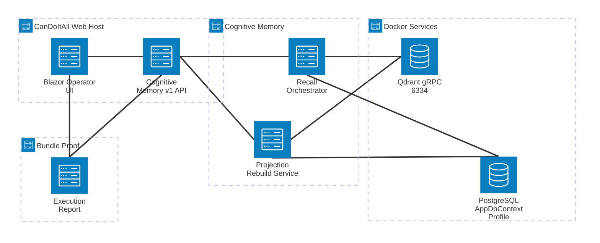
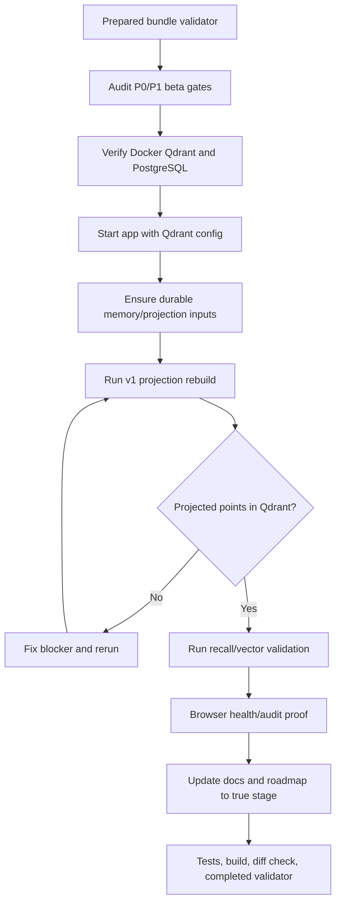

# Target Solution

## Beta Validation Architecture

## Validation Flow

## Boundaries

- Durable memory, claims, evidence, review decisions, traces, and runs stay in the active database profile.
- Qdrant proof must show projection health and searchable vector behavior; it is not source of truth.
- Validation commands may inspect Qdrant collection state, but they must not mutate durable memory outside app/API-controlled setup or explicit test fixture code.
- If code changes are needed, they must preserve API compatibility and keep provider failures explicit.

