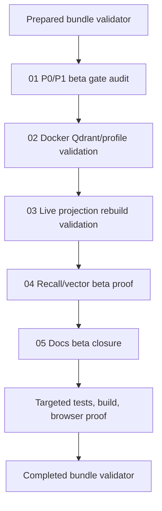

# Phase Plan

## Execution Order

1. Audit P0/P1 beta prerequisite coverage.
2. Validate Docker Qdrant/PostgreSQL and app profile readiness.
3. Execute live projection rebuild through the v1 API.
4. Execute recall/vector beta proof and browser operator proof.
5. Update docs/roadmap/bundle and run final validators.

## Subbundle Dependency Map

## Critical Subbundles

- `01-p0-p1-beta-gate-audit` decides whether beta can be attempted or prerequisite repair is needed.
- `03-live-projection-rebuild-validation` is the hard provider proof gate; skipped-only rebuilds are not enough.
- `04-recall-vector-beta-proof` verifies the projected data is actually usable by recall.
- `05-docs-beta-closure` must not claim beta unless all earlier gates pass.

## Phase Gates

- Gate before implementation: prepared-stage validator must pass.
- Gate after subbundle 01: no hidden P0/P1 blocker remains, or the blocker is converted into implementation work.
- Gate after subbundle 02: Docker Qdrant/PostgreSQL and app status/profile are proven.
- Gate after subbundle 03: live projection rebuild produces Qdrant-backed projected items or a fixed explicit failure.
- Gate after subbundle 04: recall/vector behavior and operator UI visibility are proven.
- Gate after subbundle 05: docs/roadmap match evidence; tests/build, diff check, browser proof, and completed-stage validator pass.

