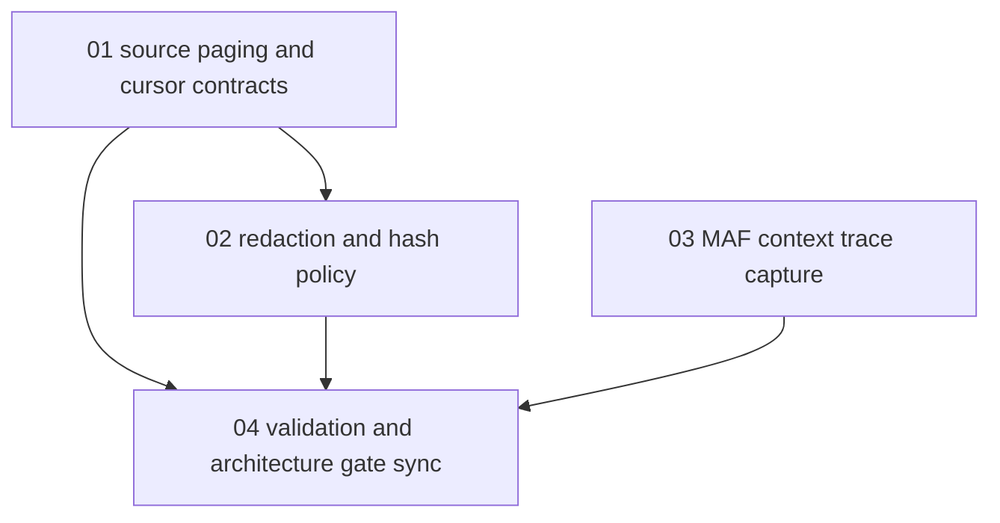

# Phase Plan

## Execution Order

1. `01-source-paging-and-cursor-contracts`
2. `02-redaction-and-hash-policy`
3. `03-maf-context-trace-capture`
4. `04-validation-and-architecture-gate-sync`

## Subbundle Dependency Map

## Critical Subbundles

- `01-source-paging-and-cursor-contracts` is a critical ingestion foundation. If cursor behavior is weak, every downstream backfill, consolidation, and projection rebuild is untrustworthy.
- `02-redaction-and-hash-policy` is a critical security foundation. If redaction/hash semantics are weak, future Qdrant and LLM context paths may leak sensitive data.
- `03-maf-context-trace-capture` is a critical audit foundation. If contributor traces are missing, future recall/context injection cannot be debugged or explained reliably.

## Phase Gates

| Gate | Required proof |
|---|---|
| Preparation gate | Prepared-stage validator passes and exact source references exist. |
| Paging gate | Providers return bounded pages through query-backed or explicitly bounded source paths; invalid/stale cursor behavior is tested. |
| Redaction/hash gate | Workbench, Process, and Workflow tests prove exposed content, metadata, and hashes follow the new policy. |
| MAF trace gate | Context contribution tests prove trace metadata is retained for provided, skipped, and failed contributors. |
| Closure gate | Targeted tests and source review pass; Cognitive Memory architecture gate/report is synchronized. |
