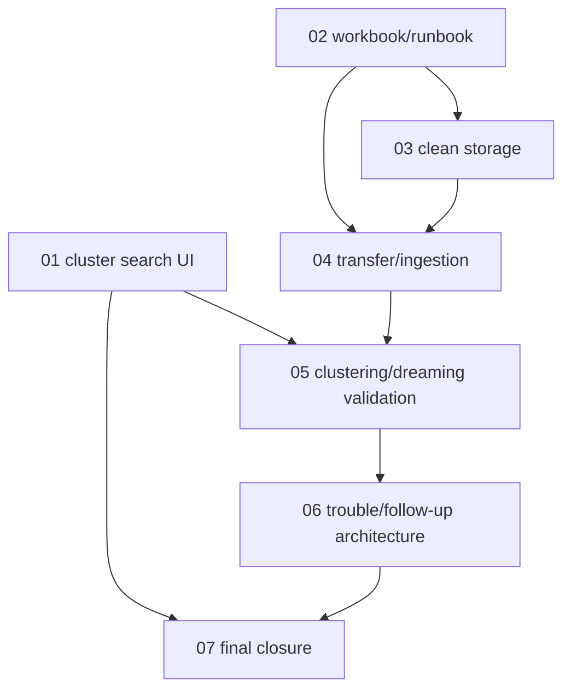

# Phase Plan

## Execution Order

1. Implement cluster-search service contract, query, component, and tab wiring.
2. Create and verify the XLSX validation workbook.
3. Inspect/start the web app and validate API status.
4. Attempt clean PostgreSQL/Qdrant readiness and transfer path discovery.
5. Run available ingestion/clustering/dreaming/approval/probe validation steps.
6. Record troubles and prepare a follow-up architecture bundle.
7. Run final proof, validators, and raw-note closure.

## Subbundle Dependency Map

- `01-cluster-search-data-contract-ui` unlocks browser proof and component tests.
- `02-validation-workbook-and-runbook` unlocks long-running validation tracking.
- `03-clean-postgres-qdrant-environment` gates the full realistic validation path.
- `04-project-source-truth-transfer-and-ingestion` depends on clean storage readiness or records a blocker.
- `05-clustering-dreaming-approvals-probes` depends on ingestion results or records a blocker.
- `06-trouble-log-followup-architecture` consumes findings from all earlier subbundles.
- `07-final-proof-closure` depends on all previous subbundles being completed or honestly blocked.

## Critical Subbundles

- `01-cluster-search-data-contract-ui` is critical because the user explicitly requested the new tab.
- `03-clean-postgres-qdrant-environment` is critical because it determines whether validation can be proven end to end.
- `06-trouble-log-followup-architecture` is critical because unresolved troubles must become actionable architecture work, not prose-only risk.

## Phase Gates

- Gate 1: Prepared-stage bundle validator passes before implementation proceeds.
- Gate 2: Cluster search tests/build pass before browser proof.
- Gate 3: API status and environment discovery proof exists before claiming realistic validation.
- Gate 4: Each validation blocker is mapped to a trouble row and follow-up item.
- Gate 5: Completed-stage bundle validator passes before closure.
