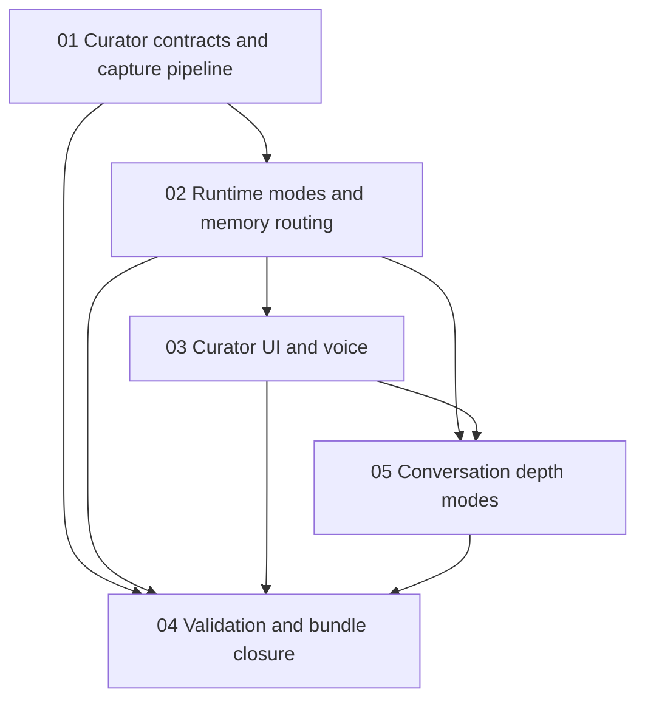

# Phase Plan

## Subbundle Dependency Map

## Critical Subbundles

- `01-01-curator-contracts-and-capture-pipeline`: Critical foundation. Every later phase depends on the shared turn/capture contract, trusted-human provenance, approval bypass semantics, recall trace id, and affected memory ids.
- `02-02-curator-runtime-modes-and-memory-routing`: Critical foundation. UI and voice are meaningful only if both runtime modes feed the same memory-improvement path.
- `03-03-curator-ui-and-voice`: UI-critical. The user explicitly asked for fluent talk and proper UI, so closure requires browser proof.
- `05-05-conversation-depth-modes`: Follow-up feature. It extends the completed curator surface with short/medium/long response depth and depth-based recall/aggregation breadth.

## Execution Order

1. `01-01-curator-contracts-and-capture-pipeline`
2. `02-02-curator-runtime-modes-and-memory-routing`
3. `03-03-curator-ui-and-voice`
4. `05-05-conversation-depth-modes`
5. `04-04-validation-and-bundle-closure`

## Phase Gates

- Gate 1: Do not start runtime mode wiring until curator contracts can persist trusted correction/new-knowledge artifacts and expose affected memory ids.
- Gate 2: Do not start UI until agent/direct modes return the same result contract and errors are explicit.
- Gate 3: Do not close UI until voice controls call the same send/speak path as text and browser proof confirms the controls render.
- Gate 4: Do not close depth modes until service budgets, prompts, persisted turn/capture metadata, UI selector behavior, EF model, and browser proof agree.
- Gate 5: Do not close the bundle until tests, build, browser analytics, raw-note closure, follow-up closure, and final validators agree.

## Execution Notes

- Use the smallest service abstraction that keeps UI out of persistence and provider details.
- Existing probe feedback is useful precedent but must not be changed to bypass review globally.
- Direct LLM mode should fail with a clear message if no default provider is configured.
- Agent mode should fail with a clear message if no default/selected agent is configured.
