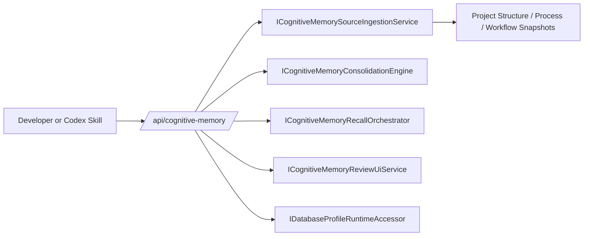

# Target Solution

## Developer API

Add `CognitiveMemoryApi` under the existing `/api` route group:

- Keep API mapping in `CanDoItAll.Web.Api`.
- Reuse existing `ApiEndpointResults` error shape.
- Map external JSON requests into strongly typed Cognitive Memory contracts.
- Do not add direct database access to the API.
- Do not hide missing semantic/RAG providers.

The API is intentionally thin:

## Skill

Install `candoitall-api-cognitive-memory` under `C:\Users\lucys\.codex\skills`. The skill gates behavior testing on:

- `GET /api/cognitive-memory/status`
- `GET /_dev/database/selection`
- active PostgreSQL provider

## PostgreSQL Smoke

The smoke flow is:

1. Create a dedicated PostgreSQL database.
2. Activate it through `/_dev/database/profiles/postgresql`.
3. Load sample projects through `/api/project-structure`.
4. Ingest each project with `/api/cognitive-memory/sources/ingest`.
5. Run consolidation through `/api/cognitive-memory/consolidation/runs`.
6. Read `/api/cognitive-memory/snapshot`.
7. Attempt `/api/cognitive-memory/recall` and record either success or explicit provider-unavailable error.
