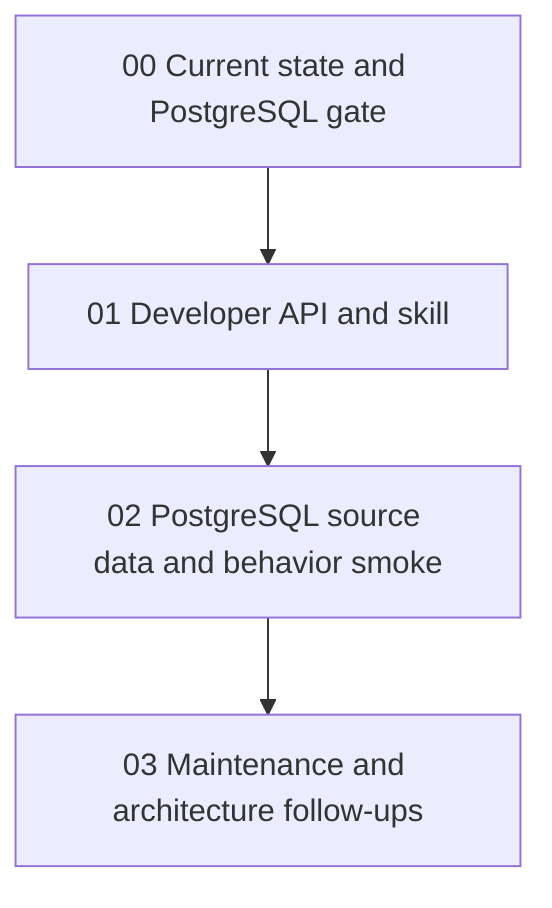
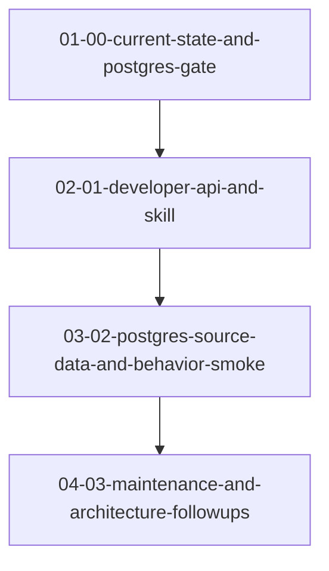

# Phase Plan

## 00 Current State And PostgreSQL Gate

Status: `Completed`

- Analyze previous bundle and last commit.
- Record done/remaining split.
- Confirm PostgreSQL-first rule for new behavior smoke.

## 01 Developer API And Skill

Status: `Completed`

- Add `/api/cognitive-memory` routes.
- Add OpenAPI route assertions.
- Install `candoitall-api-cognitive-memory` skill.
- Build web project.

## 02 PostgreSQL Source Data And Behavior Smoke

Status: `Completed with explicit recall-provider limitation`

- Create dedicated PostgreSQL database.
- Activate profile through dev API.
- Load sample source data through project-structure APIs.
- Ingest and consolidate through Cognitive Memory APIs.
- Capture snapshot and recall evidence.

## 03 Maintenance And Architecture Follow-Ups

Status: `Completed for follow-up scope`

- Record refactor targets.
- Record remaining original-bundle phases.
- Identify provider-health and MAF-integration follow-ups.

## Critical Gates

- Do not run behavior smoke unless `/api/cognitive-memory/status` reports PostgreSQL.
- Do not treat vector/recall provider-unavailable responses as success.
- Keep sample data in bundle artifacts, not test code.

## Execution Order

1. `01-00-current-state-and-postgres-gate`
2. `02-01-developer-api-and-skill`
3. `03-02-postgres-source-data-and-behavior-smoke`
4. `04-03-maintenance-and-architecture-followups`

## Subbundle Dependency Map

- `02-01-developer-api-and-skill` depends on the PostgreSQL-first gate from `01-00-current-state-and-postgres-gate`.
- `03-02-postgres-source-data-and-behavior-smoke` depends on the API and skill from `02-01-developer-api-and-skill`.
- `04-03-maintenance-and-architecture-followups` depends on smoke evidence or a concrete blocker from `03-02-postgres-source-data-and-behavior-smoke`.

## Critical Subbundles

- `02-01-developer-api-and-skill`: required before any API-driven smoke can run.
- `03-02-postgres-source-data-and-behavior-smoke`: required before final closure.

## Phase Gates

- Gate 1: Current-state analysis names original-bundle gaps.
- Gate 2: API build succeeds and the skill is installed.
- Gate 3: Active database profile is PostgreSQL before behavior smoke.
- Gate 4: Evidence records ingestion, consolidation, snapshot, and recall readiness.
