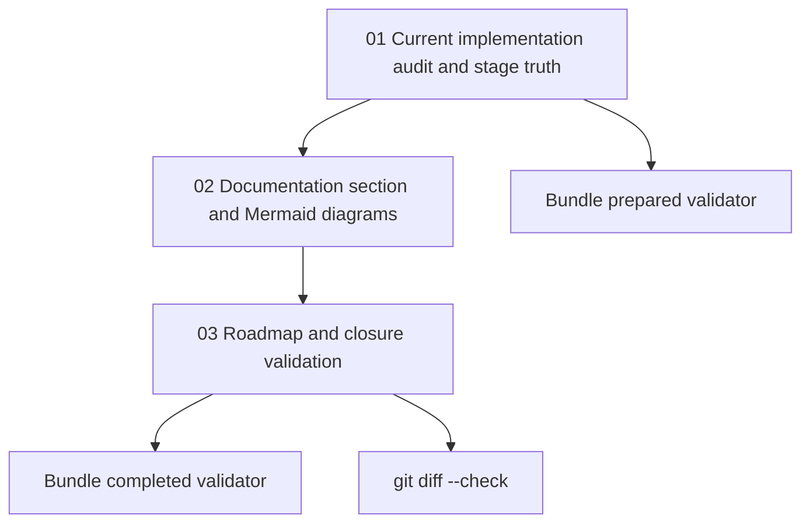

# Phase Plan

## Execution Order

1. Audit the current implementation and establish the stage truth.
2. Create the dedicated docs section and Mermaid diagrams from the audit.
3. Add roadmap, update existing docs pointers, and close bundle validation.

## Subbundle Dependency Map

## Critical Subbundles

- `01-current-implementation-audit-and-stage-truth` is the critical foundation because every stage claim, diagram, and roadmap item depends on accurate source interpretation.
- `02-documentation-section-and-mermaid-diagrams` is the user-visible delivery phase; weak proof here would leave the request only partially satisfied.
- `03-roadmap-and-closure-validation` is the closure phase; it prevents stale entry points and validates that raw notes were actually closed.

## Phase Gates

- Gate after subbundle 01: stage assessment must be source-grounded and must not call Cognitive Memory beta.
- Gate after subbundle 02: docs folder and diagrams must exist, with architecture-beta, flowchart, class, and sequence diagram blocks.
- Gate after subbundle 03: roadmap and existing docs pointers must be updated.
- Gate before closure: run bundle validator for prepared and completed stages.
- Gate before closure: run `git diff --check`.
- Browser gate: `N/A - documentation-only`, recorded explicitly in execution report.
