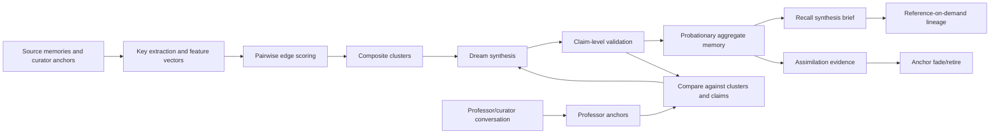

# Target Solution

## Target cognitive loop

## Composite clustering target

Clustering should be based on candidate-pair similarity and separation, not single-key grouping. Each edge should store or compute:

- positive signals: semantic topic overlap, entity overlap, task/intent overlap, source/evidence overlap, relation support, temporal continuity, professor-anchor target match;
- negative signals: contradiction, wrong scope, access/risk mismatch, generic-only entity token, stale/superseded source, mutually exclusive temporal facts;
- explanations: which keys made the edge strong or weak;
- bounded candidate generation: project, recent record window, key-index preselection, and max-pair limits.

## Dreaming target

Dreaming should produce domain-useful knowledge:

- extract normalized claims from source memories;
- group equivalent claims;
- separate conflicting claims into conflict frames;
- synthesize a canonical aggregate summary without internal score boilerplate;
- attach claim-level source maps;
- apply aggregate memory only as probationary or weak accept unless validation is strong.

## Professor learning target

Professor/curator statements are high-trust learning anchors. They should not be forgotten too early and should not dominate permanently. They need lifecycle:

- `Active`: raw trusted anchor exists and may guide comparison.
- `Comparing`: the system has located related memories/clusters and is evaluating fit/conflict.
- `Applied`: optional immediate correction/knowledge memory for operational use.
- `Assimilated`: a distinct derived memory/aggregate/repeated-use proof shows the system internalized the knowledge.
- `Faded`: raw anchor is no longer critical because learned knowledge is stable elsewhere, but provenance remains available.
- `Rejected`: later evidence or professor correction invalidated the anchor.

The existing enum lacks `Applied`, but implementation may model applied status through capture status plus anchor state if the state machine is still explicit and tested.

## Recall synthesis target

Recall should create a brief, not a context dump:

- query-aware statement selection;
- de-duplication by claim signature;
- caveats for conflicts, stale facts, restricted provenance, and low confidence;
- no internal diagnostic scores by default;
- stable reference tokens or statement IDs for on-demand source expansion;
- phrase/claim-level source map so references can explain why each statement appeared.
