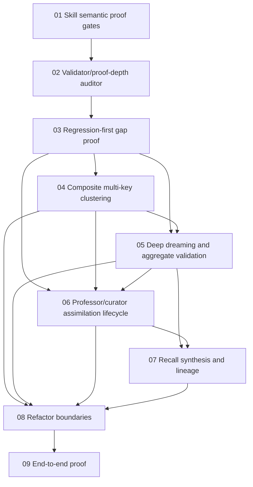

# Phase Plan

## Execution Order

1. Skill semantic proof gate installation.
2. Validator and proof-depth auditor hardening.
3. Regression-first gap proof corpus.
4. True composite multi-key clustering.
5. Deep dreaming, validation, and calibrated aggregate application.
6. Professor/curator anchor learning lifecycle.
7. Recall synthesis brief and reference lineage.
8. Refactor service boundaries and persistence versioning.
9. End-to-end neurocognitive quality proof.

## Phase Sequence

The first two subbundles are process-critical and must be completed before any cognitive-memory implementation work. Subbundle 03 then creates failing-first proof. Subbundles 04-07 implement the core behavior. Subbundle 08 cleans service boundaries and migration details. Subbundle 09 closes the end-to-end proof.

## Subbundle Dependency Map

## Critical Subbundles

- SB01 is critical because later subbundles must execute under improved anti-shallow gates.
- SB02 is critical because structural validation currently cannot detect semantic failure.
- SB03 is critical because it proves the actual gaps before they are repaired.
- SB04 is critical because dreaming and recall depend on real clusters.
- SB06 is critical because professor input can otherwise corrupt memory or fade before internalization.
- SB09 is critical because isolated tests cannot prove the cognitive loop.

## Phase Gates

- No cognitive-memory code changes before SB01 and SB02 are completed and the updated skills are reopened by the implementation agent.
- No clustering completion without merge and split adversarial tests.
- No dream completion while canonical aggregate memory contains diagnostic boilerplate as content.
- No professor assimilation completion if a direct curator-applied memory can be used as its own derived proof.
- No recall synthesis completion if output is title-grouped line concatenation.
- No final completion without completed-stage bundle validation plus the new proof-depth auditor.
