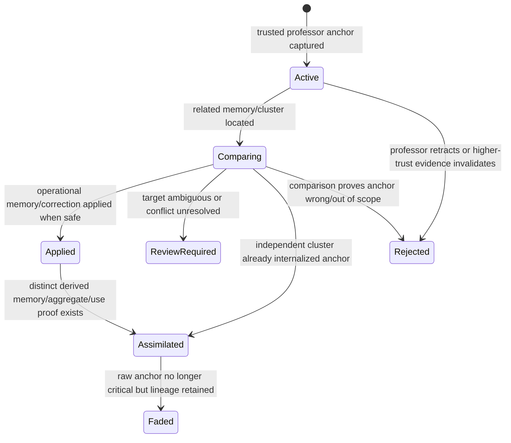

# Professor Learning State Machine

Assimilation cannot use the same memory record created directly from the anchor as its own proof. It must use an independent derived memory record, aggregate record, cluster assimilation observation, or repeated correct use observation that references but is not identical to the professor anchor.
