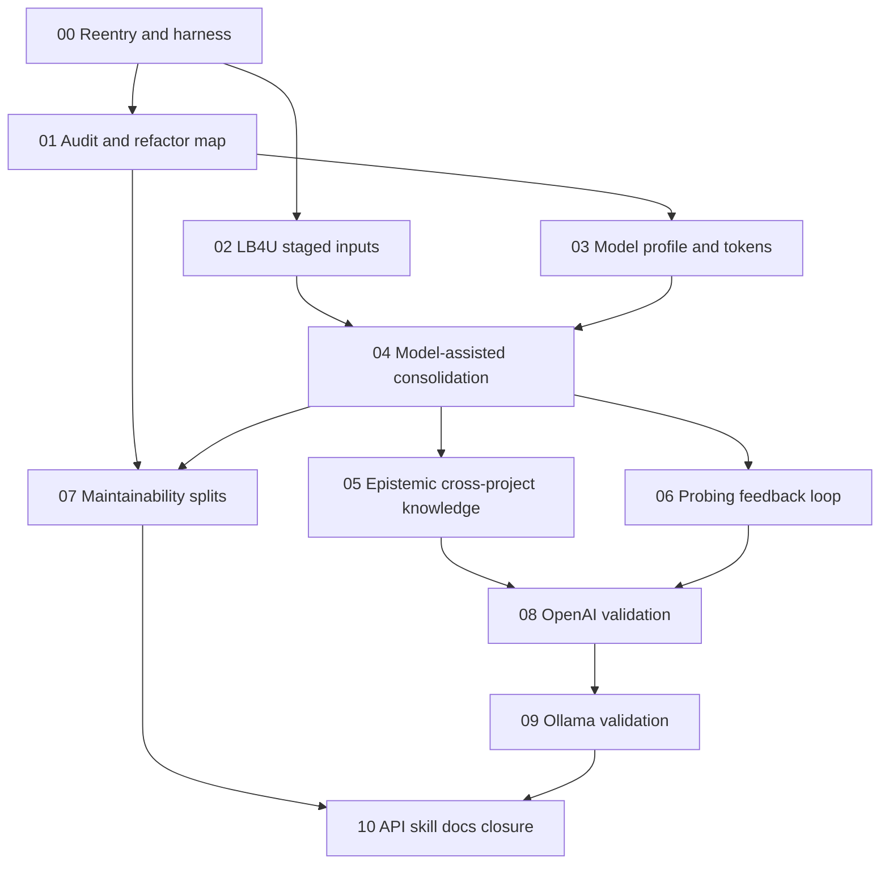

# Phase Plan

## Execution Order

| Order | Subbundle | Purpose | Exit Gate |
| ---: | --- | --- | --- |
| 0 | `00-reentry-and-harness-gate` | Re-enter safely, confirm environment, tests, and API readiness. | Baseline evidence captured. |
| 1 | `01-implementation-audit-refactor-map` | Confirm current behavior and refactor targets against source. | Approved narrow implementation map. |
| 2 | `02-lb4u-staged-inputs-secret-safety` | Build staged LB4U manifest and secret exclusion harness. | Manifest validated, exclusions proven. |
| 3 | `03-model-profile-token-settings` | Add or verify model role settings and output token metadata. | OpenAI and Ollama profiles explicit. |
| 4 | `04-model-assisted-consolidation` | Improve chunking, candidate quality, and reviewable consolidation. | Candidate quality tests pass. |
| 5 | `05-epistemic-cross-project-knowledge` | Improve coverage scans and reusable knowledge proposals. | Generic planning knowledge appears only through reviewed support. |
| 6 | `06-probing-feedback-regression-loop` | Improve human probing, feedback, study loop, and regression probes. | Probe improvement proof captured. |
| 7 | `07-maintainability-file-splits` | Split oversized services and page/API files after tests exist. | Build/tests pass with smaller boundaries. |
| 8 | `08-openai-lb4u-validation-cycle` | Run multi-stage OpenAI `gpt-5-mini` validation. | Probe and memory quality gates pass. |
| 9 | `09-ollama-gptoss20b64k-validation` | Validate local Ollama behavior and token budget. | Local validation proof captured. |
| 10 | `10-api-skill-docs-closure` | Update API, skill, docs, workbook, and final report. | Completed-stage bundle gate passes. |

## Subbundle Dependency Map

## Critical Subbundles

- `02-lb4u-staged-inputs-secret-safety` is critical because all behavioral proof depends on a realistic staged source manifest and secret exclusion.
- `03-model-profile-token-settings` is critical because the user explicitly requires `gpt-5-mini`, `gptoss20b64k`, and output token proof.
- `04-model-assisted-consolidation` is critical because current deterministic consolidation may be too shallow for the requested memory quality.
- `08-openai-lb4u-validation-cycle` is critical because it proves the main realistic workflow before local-model parity testing.
- `09-ollama-gptoss20b64k-validation` is critical because local validation and token-limit proof are explicit user requirements.

## Phase Gates

| Gate | Required Before Moving On |
| --- | --- |
| Baseline gate | Build/test/API status captured, database profile known, and no unrelated worktree changes mixed into execution. |
| Manifest gate | LB4U staged manifest validates, excluded file proof exists, and source summaries are linked. |
| Model gate | Model role/profile/token settings are explicit and tested for OpenAI plus Ollama. |
| Consolidation gate | Candidates are source-backed, reviewable, and materially better than shallow classification. |
| Probe gate | Probe answers cite memory context and improve after study/review cycles. |
| Refactor gate | Behavioral tests exist before splitting large files. |
| OpenAI gate | Multi-cycle `gpt-5-mini` evidence passes quality checks. |
| Ollama gate | `gptoss20b64k` evidence passes or fails with actionable output-token/truncation proof. |
| Closure gate | Completed bundle validator passes and docs/skill/workbook are current. |
