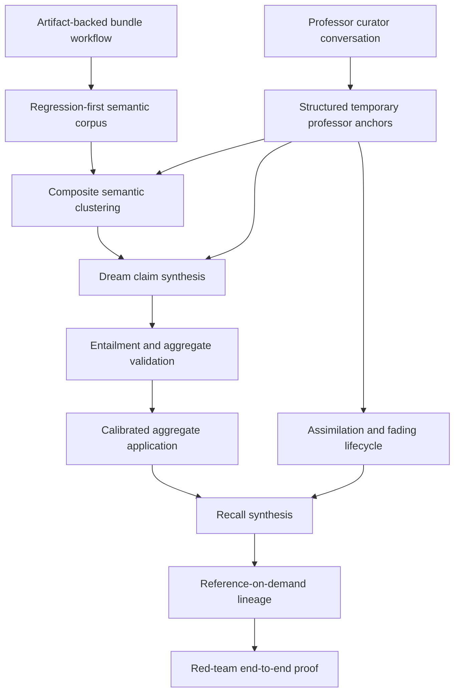

# Target Solution

## Target Architecture Layers

## Behavioral Model

1. Source memories are indexed into composite semantic signals.
2. Clustering creates bounded candidate pairs from exact keys, aliases, rare token phrases, evidence overlap, relation edges, and optional embedding/provider similarity.
3. Components are evaluated for internal cohesion. Weak bridge chains are split or routed to review.
4. Dreaming transforms coherent clusters into aggregate claim groups. It does not merely choose one representative source sentence.
5. Validation checks claim coverage, conflict separation, independence, access policy, duplicate aggregates, professor-anchor lifecycle, and synthesis-vs-copy quality.
6. Professor/curator mode captures human guidance as temporary structured anchors. Anchors can influence comparison and review, but are not ordinary stable knowledge until assimilation criteria pass.
7. Assimilation requires independent non-descendant evidence and repeated successful integration into clusters/dreams/recall.
8. Recall synthesizes a brief suited to the task and policy context. References remain hidden by default but are precisely resolvable on demand.

## Required Collaborators

- `ICognitiveMemoryProofManifestValidator`
- `ICognitiveMemoryClusterKeyExtractor`
- `ICognitiveMemoryCandidatePairSelector`
- `ICognitiveMemoryClusterCohesionSplitter`
- `ICognitiveMemoryDreamClaimSynthesizer`
- `ICognitiveMemoryDreamEntailmentValidator`
- `ICognitiveMemoryProfessorTeachingExtractor`
- `ICognitiveMemoryProfessorAssimilationEvaluator`
- `ICognitiveMemoryRecallBriefComposer`
- `ICognitiveMemoryStatementLineageResolver`

## Algorithm Versioning

Every changed behavior must have an explicit algorithm version and tests must assert the intended version where records are persisted.
