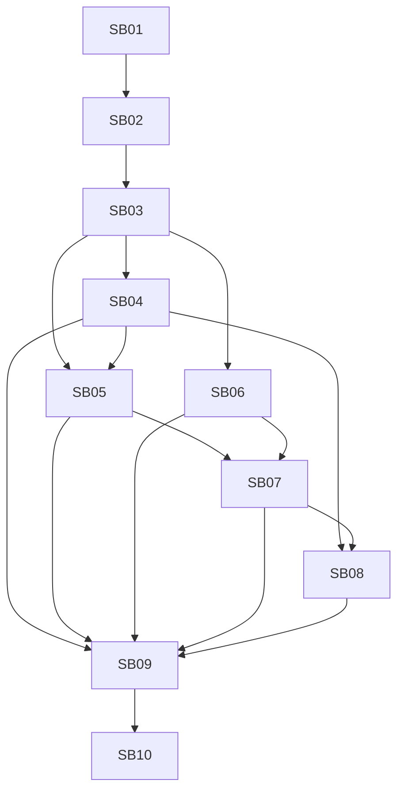

# Phase Plan

## Execution Order

1. SB01 - Install artifact-backed workflow skill rules.
2. SB02 - Implement artifact-backed validator and fake-proof fixtures.
3. SB03 - Add regression-first adversarial semantic corpus.
4. SB04 - Finish semantic clustering and bridge splitting.
5. SB05 - Finish dream synthesis and entailment validation.
6. SB06 - Finish natural professor capture and structured anchors.
7. SB07 - Finish assimilation, mastery, and fading lifecycle.
8. SB08 - Finish recall task brief and precise lineage.
9. SB09 - Refactor service boundaries and algorithm configuration.
10. SB10 - Run red-team end-to-end quality proof and final closure.

## Subbundle Dependency Map

## Critical Subbundles

- SB01 is critical because it prevents another prose-only execution.
- SB02 is critical because it makes semantic proof artifact-backed and executable.
- SB03 is critical because all feature work must first fail the shallow implementation.
- SB04 is critical because clustering quality determines all downstream dreaming.
- SB05 is critical because dream aggregates must be useful and validated.
- SB06 is critical because professor capture is the comfortable learning mode.
- SB07 is critical because professor guidance must be internalized rather than blindly retained.
- SB08 is critical because recall output is the main consumer-facing behavior.
- SB10 is critical because it must red-team the whole loop.

## Phase Gates

- Gate A: SB01-SB02 must pass with installed/reopened skills and validator fixtures before any feature source file changes.
- Gate B: SB03 must show failing-first evidence against the current implementation before SB04-SB08 production changes.
- Gate C: SB04-SB08 cannot close unless their negative tests fail before implementation and pass after implementation.
- Gate D: SB09 cannot close unless extracted collaborators are registered and directly tested.
- Gate E: SB10 cannot close unless the full end-to-end professor-learning/dream/recall scenario passes and red-team review finds no shallow-pass gaps.
